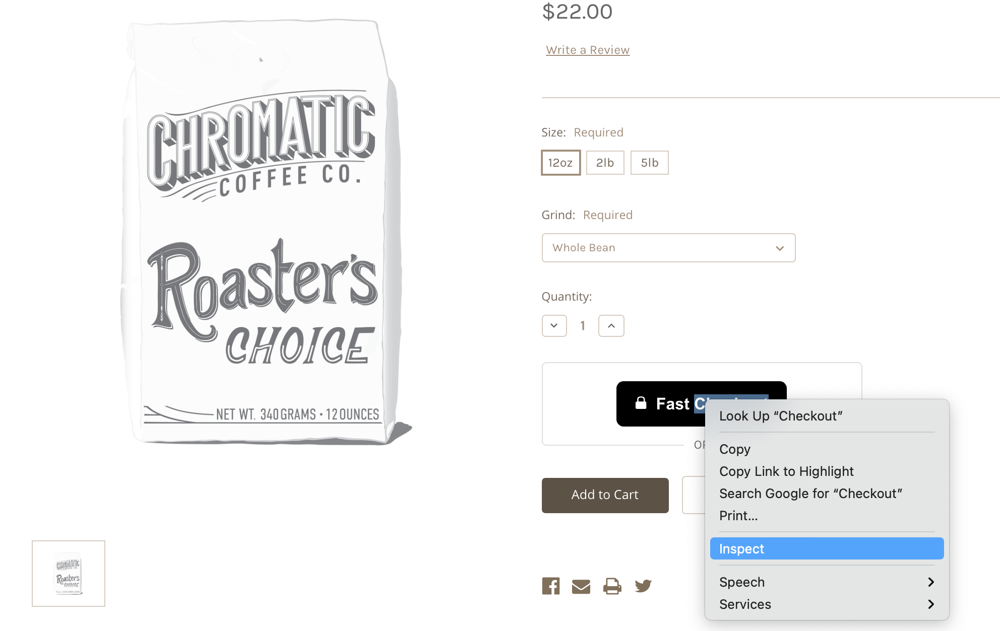
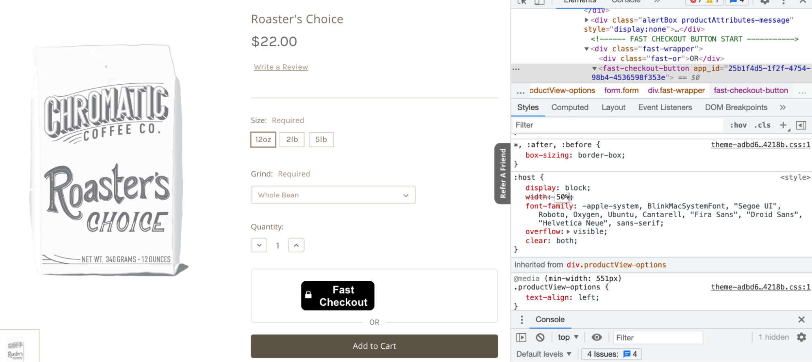

# Styling Fast Buttons

1. On the page in your online store that you want to edit, right click or control click the Fast button and click “Inspect.”

2. In the code that appears, click `
` or one of the lines below that line.
3. Then, in the styling box below, make adjustments to the width or font size or anything else you want to change. Keep adjusting until the Fast button and the other elements around it appear exactly how you want it.

4.  Once you know that you like the Fast button to have a certain styling feature like a certain width or font size, go to the theme file that that button lives in and apply that change there.

    > For example, if in this step, you made the width 30x, find where it says “width” in the code you added to the theme file and change the width in that theme file to 30x.

5.  Click “Save File.”
    > Note: The page might say “Save & apply file” instead of “Save File.” If that is the case, click “Save & apply file.”
