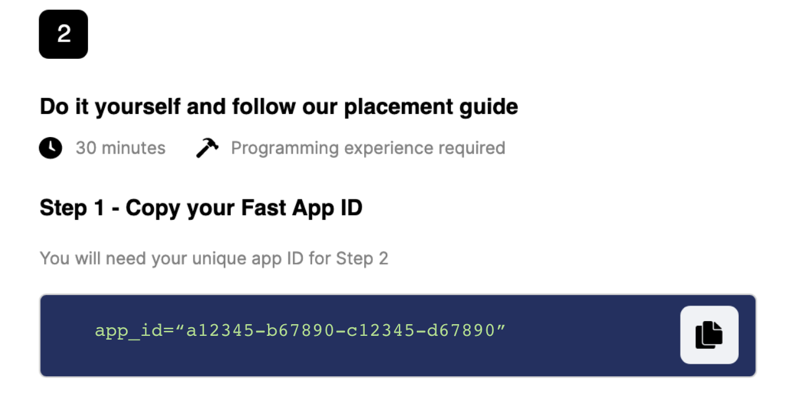
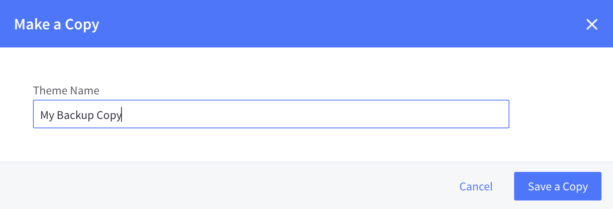
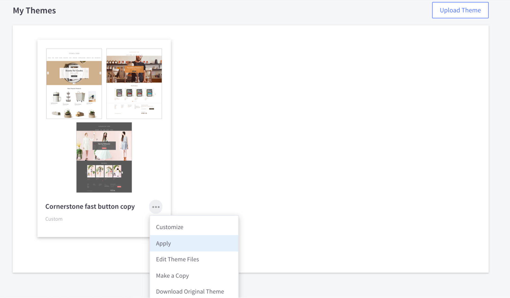
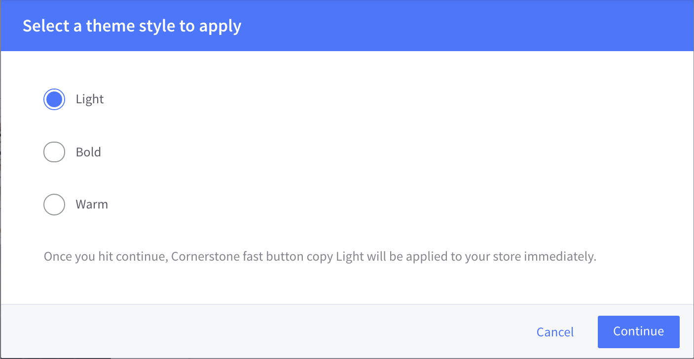

# Install BigCommerce steps

## Part 1: Setting Up Theme Files

1. Go to [https://www.fast.co/business/dash/install](https://www.fast.co/business/dash/install) to find your Fast App ID and copy and paste it into a tab or document or digital sticky note. **Keep that Fast App ID accessible throughout the rest of this process.**

   

2. Log into your BigCommerce store at [https://login.bigcommerce.com/login](https://login.bigcommerce.com/login).
3. On the sidebar, click “Storefront” → “My Themes.”
   
4. Under “Current Theme,” click “Advanced” → “Make a copy.”
   
5. Type in the name of your copy and click “Save a Copy.” This copy is specifically to have as a back-up. You can name it whatever you want, like “My Backup copy.”
   

6. Under “My Themes,” under the copy you made, click “...” → “Apply.”

 

7.  Click the style that you selected for your store’s theme. Then click “Continue.”
    Note: See “Prerequisites” at the top of this document for more information about themes and styles.

 

8.  Confirm that the copy you just made is active. To do this, look at where it says “Current Theme” and make sure that underneath that, it has the name of your backup copy. It might also have a word like “light” or “warm.” If, for any reason, the copy is not active, reach out to the Customer Success team for help at **seller-support@fast.co**.

  

9. Under “Current Theme,” click “Advanced” → “Edit Theme Files.”


> You might get a warning pop-up. If you get this pop-up, click “Edit theme files.”


## Part 2: Installing Checkout Button to Product Page

1. Click “templates” → “components” → “products” → “add to cart.html.”


2. Use command-F to find the line:
   ```
   {{#or customer (if theme_settings.restrict_to_login '!==' true)}}.
   ```
3. ABOVE this line, copy and paste the following code. When you do this, replace REPLACE-WITH-YOUR-APP-ID with your app ID.

   ```
   {{#if customer.name '===' 'Fast Testing'}}
   <!------ FAST CHECKOUT BUTTON START ----------->
   <div class="fast-wrapper">
   <div class="fast-or">OR</div>
   <fast-checkout-button app_id="REPLACE-WITH-YOUR-APP-ID"/>
   </div>
   <style>
   .fast-wrapper {
   padding-bottom: 20px;
   margin-bottom: 20px;
   }
   .fast-or {
   position: relative;
   top: 80px;
   background: white;
   width: 40px;
   text-align: center;
   margin-left: auto;
   margin-right: auto;
   color: #757575;
   }
   @media only screen and (max-width: 767px) {
   .fast-wrapper {
       border-bottom: 1px solid #dfdfdf;
       border-radius: none;
       padding-right: 1%;
       padding-left: 1%;
   }
   }
   @media only screen and (min-width: 768px) {
   .fast-wrapper {
       border: 1px solid #dfdfdf;
       border-radius: 5px;
       padding-right: 20%;
       padding-left: 20%;
   }
   }
   </style>
   <!------ FAST CHECKOUT BUTTON END ----------->
   {{/if}}
   ```

4. After copying and pasting that code, indent the code so it matches up with the other indentations in the rest of the code.

5. Click “Save File.”
   > Note: The page might say “Save & apply file” instead of “Save File.” If that is the case, click “Save & apply file.”
6. Go to the Product page on your online store and make sure that the Fast Checkout button, which appears there now, looks good to you. (You may have to refresh the page a few times before the Fast Checkout button appears.)


- If it looks good, go to the next section
- If you want to adjust how it looks, like make it bigger or less stretched out, follow the steps in the section, Styling the Buttons, located at the very bottom of this document. Then go to the next section.
