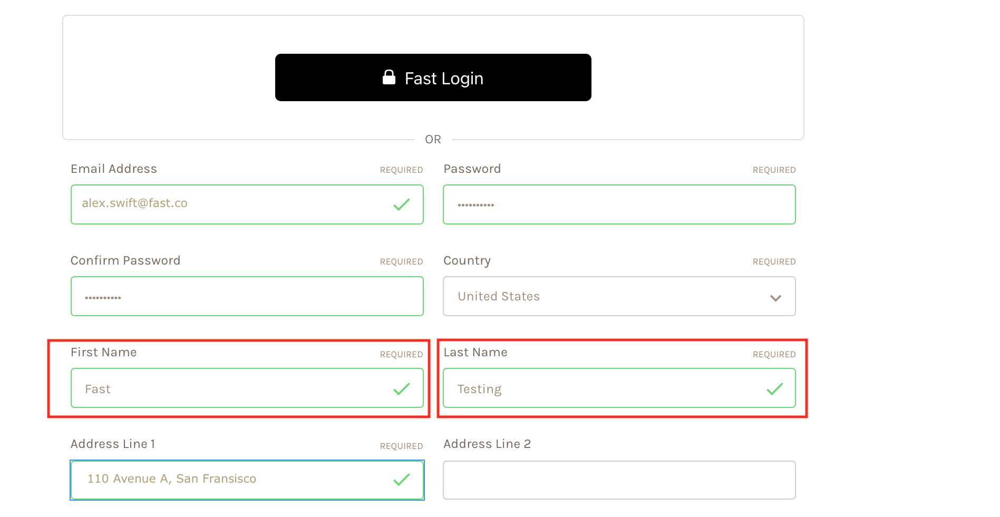
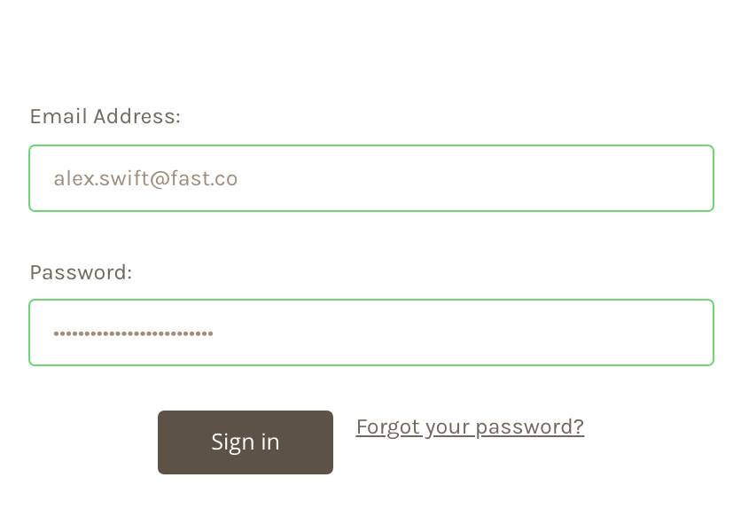

# BigCommerce test mode setup

## Overview

This **test mode** process is for testing the buttons on your website. In test mode, only you can see the Fast buttons on your website. They are not yet visible to shoppers or the general public. We advise doing test mode first so you can see for yourself how the buttons look and function. However, if you prefer to dive straight in and use the buttons in a public setting, then do this process in production mode. You can see that other version of the process [here](https://docs.google.com/document/d/1I6Fc7_PBk2ZZwNm757TmLDSPaDjufKtIrnWnH1pI8Es/edit#).

## Steps to set up test mode

1. On your online store’s website, **create an account** using:

   - **Your real email address**
   - **The first name “Fast”**
   - **The last name “Testing”**
   - **Any password you like**

   

2. **Log into the “Fast Testing” account** using the email address and password associated with the name “Fast Testing.”

> For example, if in the previous step, you used the email address “alex.swift@fast.co” and the password “fastracecar&” then use that email address and password when logging in now.

   

Stay logged into this account throughout the rest of the install process.
