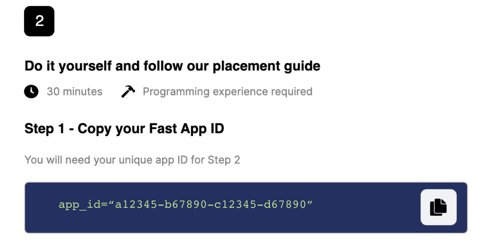
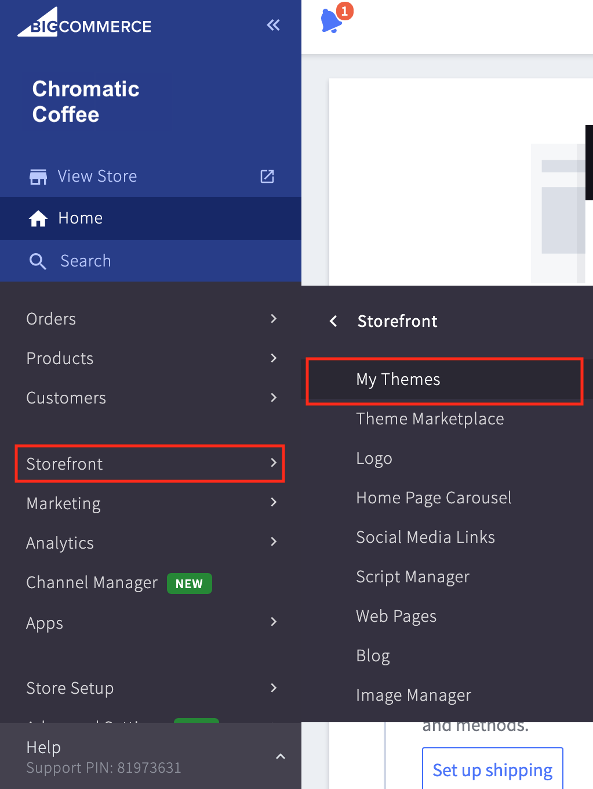
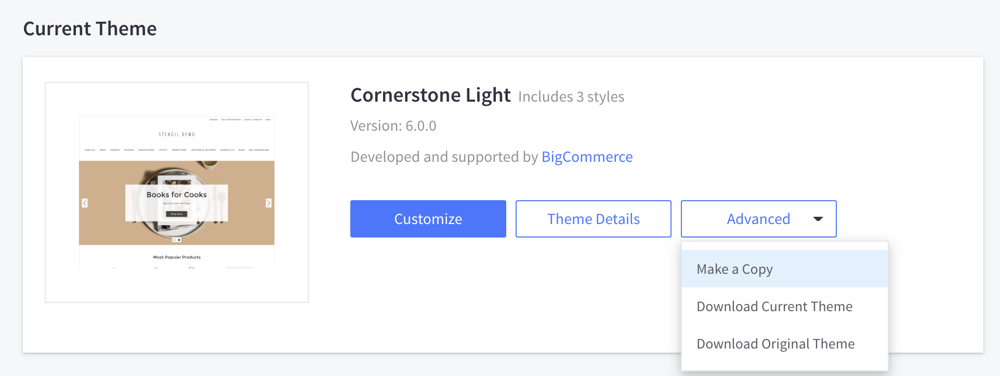
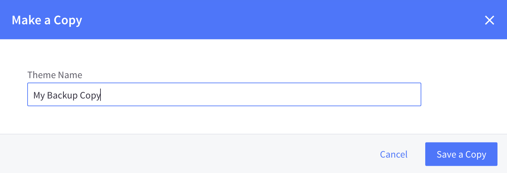
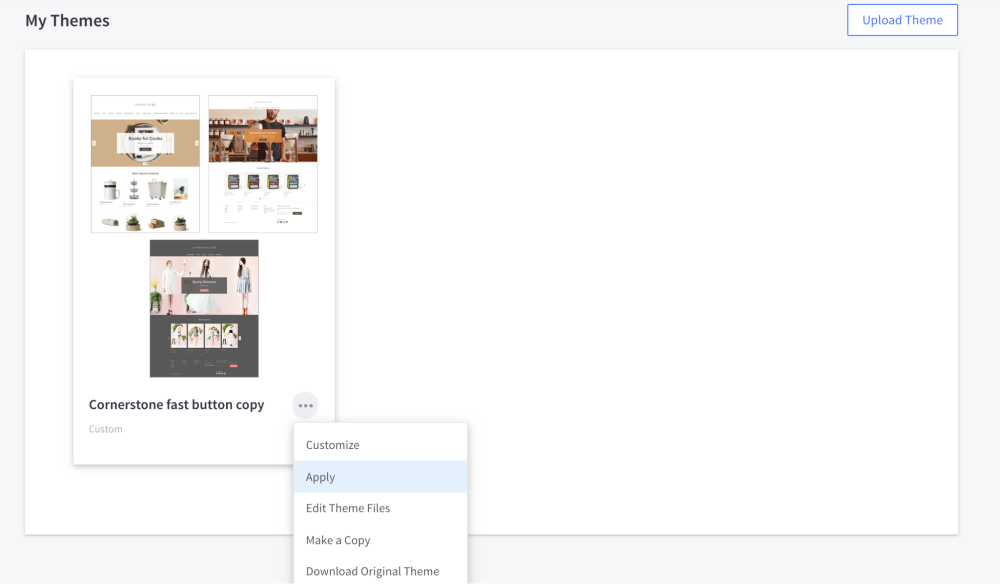
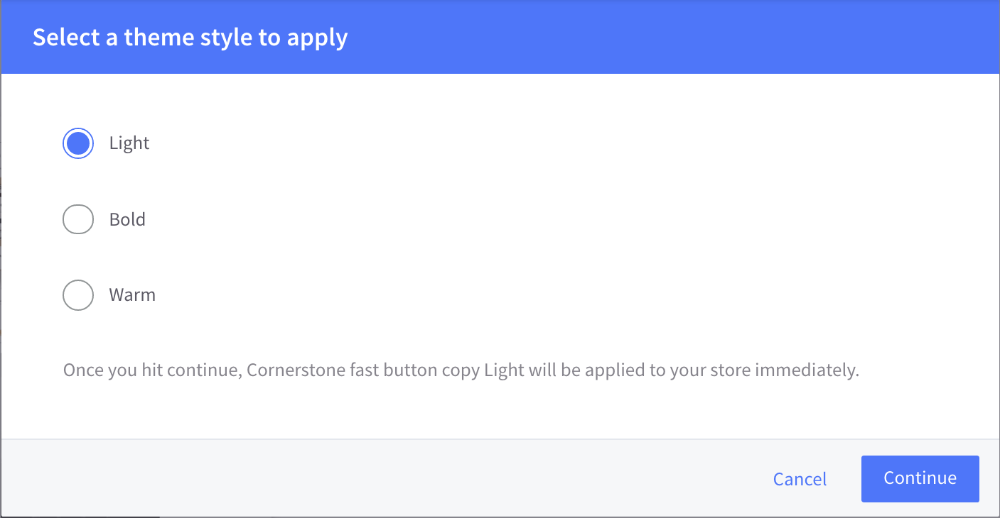
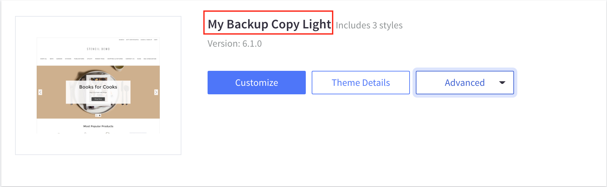
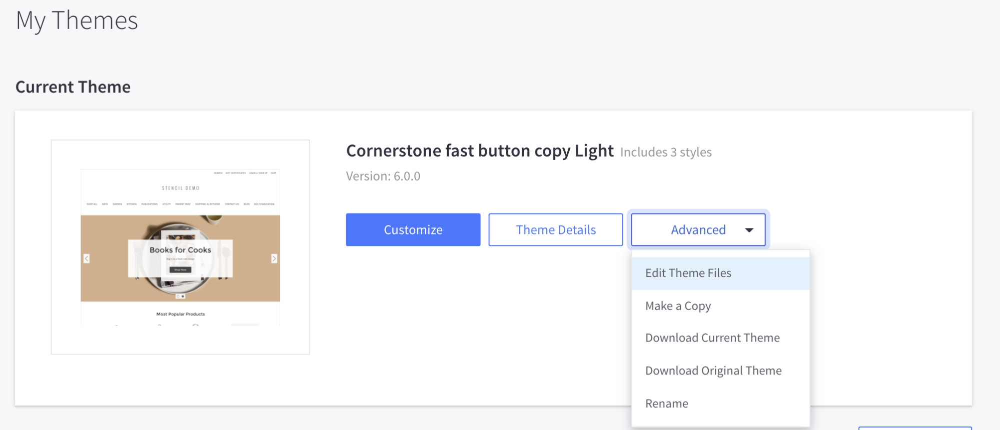
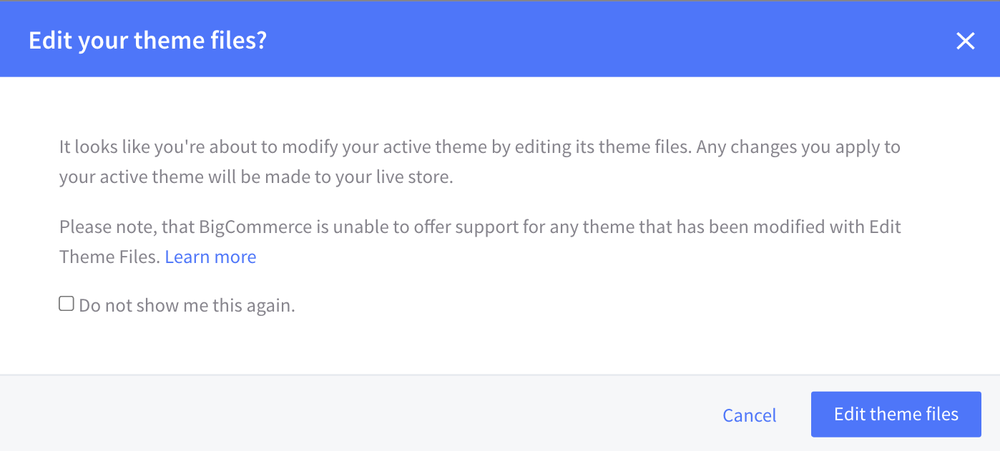

# Setting Up Theme Files

1. Go to [https://www.fast.co/business/dash/install](https://www.fast.co/business/dash/install) to find your Fast App ID and copy and paste it into a tab or document or digital sticky note. **Keep that Fast App ID accessible throughout the rest of this process.**

   

2. Log into your BigCommerce store at [https://login.bigcommerce.com/login](https://login.bigcommerce.com/login).
3. On the sidebar, click “Storefront” → “My Themes.”
   
4. Under “Current Theme,” click “Advanced” → “Make a copy.”
   
5. Type in the name of your copy and click “Save a Copy.” This copy is specifically to have as a back-up. You can name it whatever you want, like “My Backup copy.”
   

6. Under “My Themes,” under the copy you made, click “...” → “Apply.”

 

7.  Click the style that you selected for your store’s theme. Then click “Continue.”
    Note: See “Prerequisites” at the top of this document for more information about themes and styles.

 

8.  Confirm that the copy you just made is active. To do this, look at where it says “Current Theme” and make sure that underneath that, it has the name of your backup copy. It might also have a word like “light” or “warm.” If, for any reason, the copy is not active, reach out to the Customer Success team for help at **seller-support@fast.co**.

  

9. Under “Current Theme,” click “Advanced” → “Edit Theme Files.”

> You might get a warning pop-up. If you get this pop-up, click “Edit theme files.”

