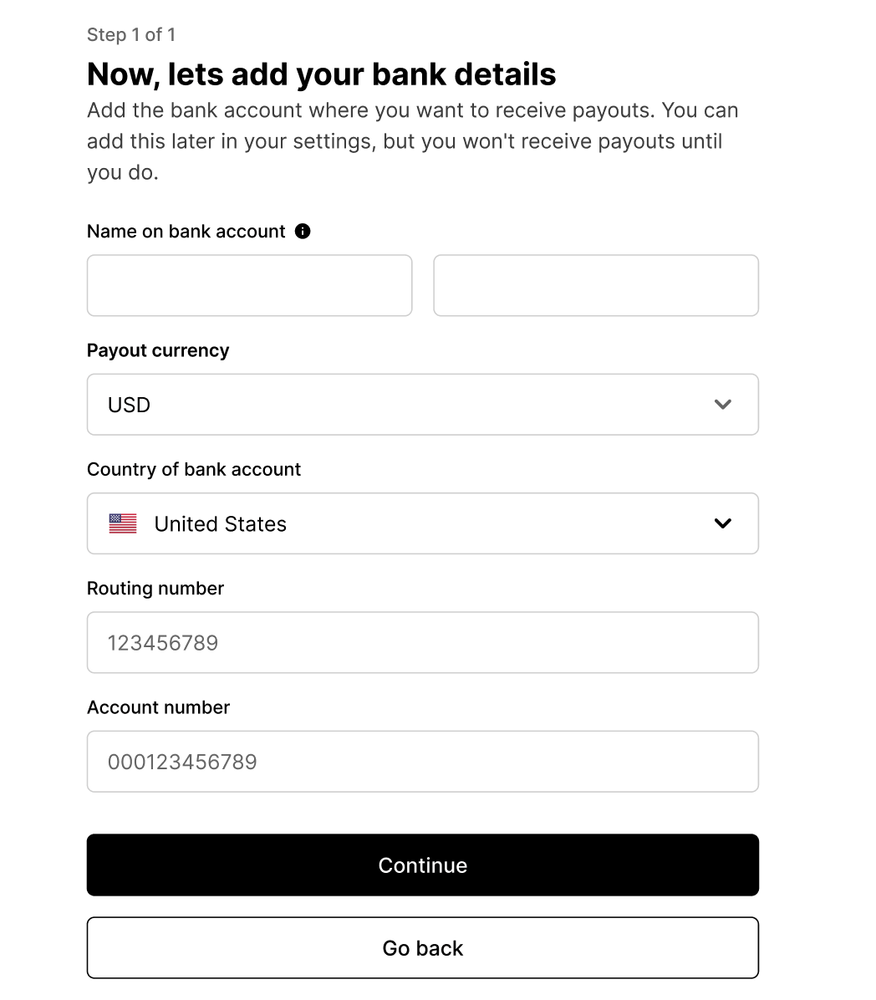

# Pre-Install Step 3: Onboard as a Seller with BigCommerce

## Prerequisites

Before you begin this process, you’ll need an online store hosted by BigCommerce.

<embed src="/reusables/for-developers/_platform_all_sign_up_as_a_seller_banner_sandbox_and_contact_support.md" />

# PIN Validation

<embed src="/reusables/for-developers/_platform_all_sign_up_as_a_seller_pin_validation.md" />

# Fill Out Your Profile

<embed src="/reusables/for-developers/_platform_all_sign_up_as_a_seller_fill_out_your_profile.md" />

3. On the Platform Page, click “BigCommerce.” Then click “Next.”

   
   
4. Add the domain of your business website. Then click “Continue”.

  
  
## Connect to BigCommerce

1. We need to authorize Fast on BigCommerce in order to install the Fast Checkout button. You’ll need the information below to connect your platform:
    1. Owner account credentials 
    2. BigCommerce account email
    3. BigCommerce account password

2. Click “Log in” and log into your BigCommerce account.
   **Note**: You need BigCommerce Store Owner access to do this.

   

3. Click the checkbox and click “Confirm.”
   

## Verification
1.  We need to verify your business to get your account set up for Fast. Once you have the information displayed, click “Verify”

   

2. Once you have entered the information displayed, click “continue” 

   

3. Wait several seconds for the business verification to complete. If this verification is unsuccessful, contact customer success at seller-support@fast.co. Otherwise, move on to the next step. Note: If you operate under a DBA, you will need to click the pencil icon in order to enter your legal name that correlates with your tax ID. 

   

4. Click “continue”
   

## Bank Details
1. On the Bank Details page, enter the following information:
    - The legal entity the bank account was registered under
    - The currency you use, such as dollars or Euros
    - The country your bank account is in
    - The applicable bank account details depending on your region Note: Which settlement currency you can use depends on which country your business is registered in. And which bank account details you see depends on what settlement currency you use. See [this article](https://stripe.com/docs/connect/bank-debit-card-payouts#supported-settlement) for more information.
    
     

2. Click “Continue”

    
