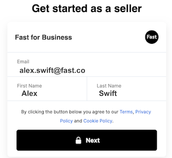
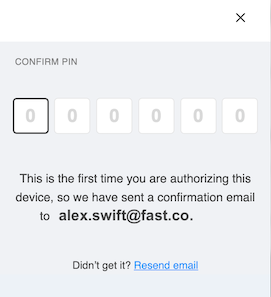
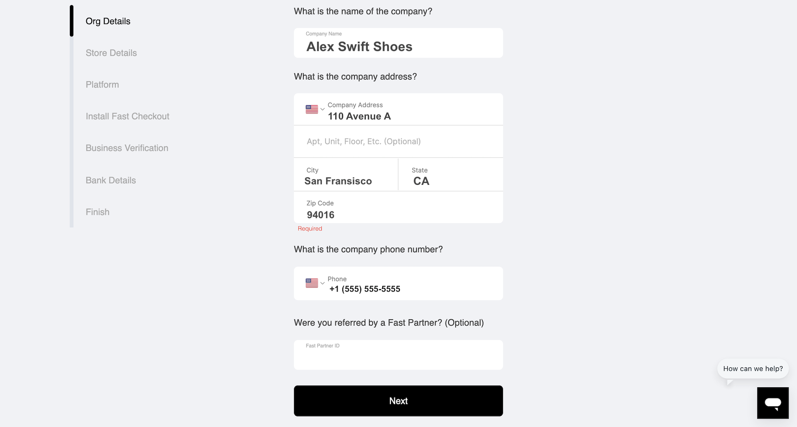
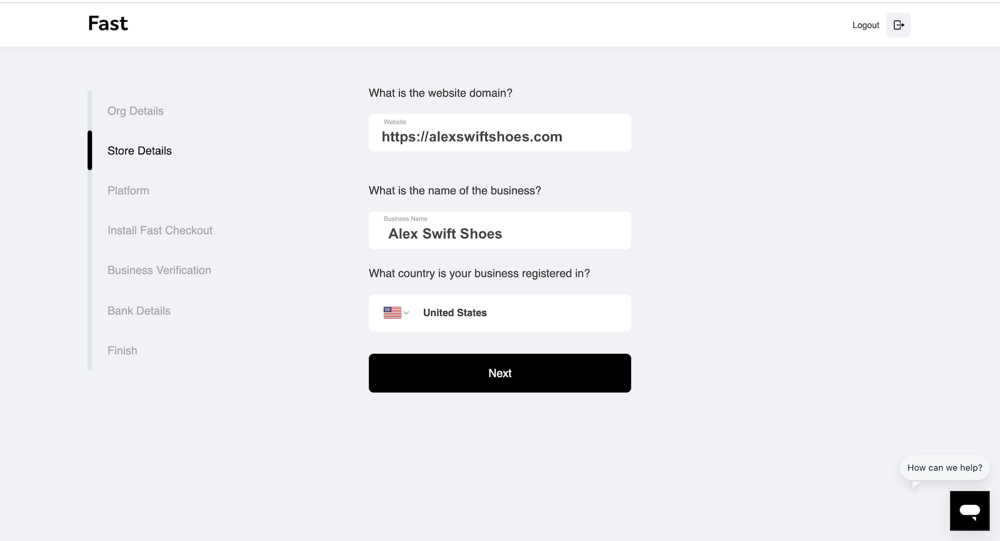

# Pre Install Step 3: Onboard as a Seller

## Prerequisites

Before you begin this process, you’ll need an online store hosted by BigCommerce. See [Fast Overview and Prerequisites](Fast-Overview-and-Prerequisites.md) for more information about this and other prerequisites. If you need help at any point, contact customer success at seller-support@fast.co.

1. On [fast.co/business](https://www.fast.co/business), **enter the following information and click “Next:**”

   - Your preferred email address (You can add additional email addresses for access later.)
   - Your first name and your last name (If your business has multiple employees, you can add more people later and give those people various levels of access and permissions.)

     

2. **Fast will now send a PIN number to your email inbox.** Open your email to find this PIN number and enter it here on Fast.
   **Note**: Fast doesn’t use passwords. We use PIN numbers instead.

   

3. On the Org Details page, **enter the following information and click “Next”**:

   - Your company name
   - Your company address
   - Your company phone number
   - Your referral number if you were referred to Fast through a partner (This is optional.)

     

4. On the Store Details page, **enter the following information and click “Next”**:

   - Your website domain
   - Your company name
   - The country where your business is registered
     

5. On the Platform Page, **click “Other.” Then click “Next.**”
