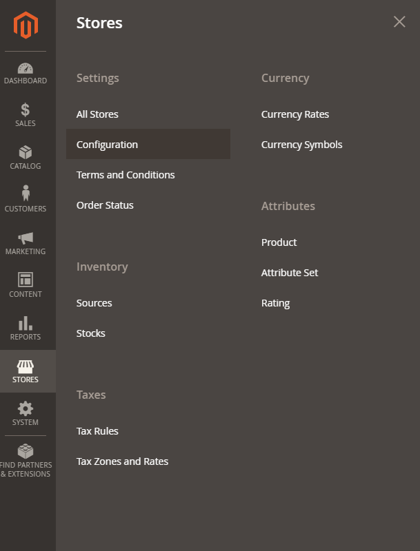
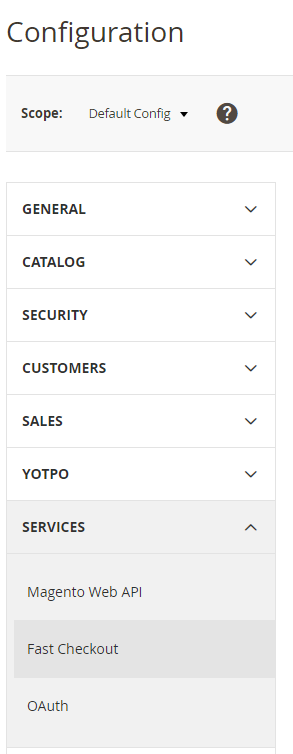
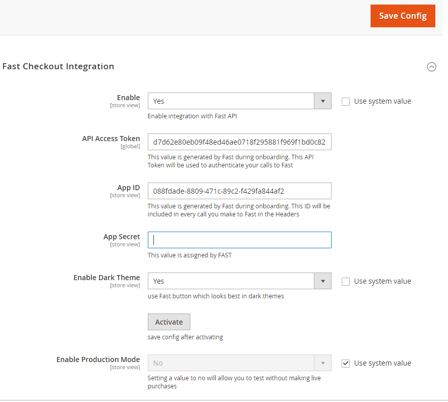

import YouTubeVideoEmbed from "../../../../components/EmbedYouTubeVideo.tsx";
import { Alert, Link } from "@redocly/developer-portal/ui";

# Install step 2: Enable Fast Checkout in Magento

The module includes the necessary code for Fast buttons to appear and work on the following page types without requiring any changes:

- Simple PDP
- Configurable PDP
- Minicart
- Cart

The following video shows how to enable Fast Checkout in Magento:

<YouTubeVideoEmbed
  embedId="1sqQlrXwaQs"
  start="53"
  end="97"
  videoTitle="Enable Fast Checkout"
/>

## Configuration

1. Log in to your admin panel.
2. Navigate to **Stores → Configuration**.\
   
3. In the Configuration screen, navigate to **Services → Fast Checkout**.\
   
4. Enter your configuration details in the relevant fields:\

   

   - Set the module to _Enabled_ on the appropriate store(s). This is a store-level configuration setting that allows you to quickly enable or disable Fast.

   - Enter your **Access Token** and **Fast App ID** given to you from Fast. This should be the sandbox credentials for initial testing.

   <embed src="/reusables/for-developers/_fast_app_id.md" />

   - Enable the dark theme if your site has a dark/black background.
   - If capturing up front, select **Enable Auth+Capture**.
   - Only select **Enable Production Mode** when you are ready to go live.

5. Save the configuration.
6. Click **Activate**.\
   A successful activation is indicated in green and will fill in the **App Secret**.
   :::info Result
   Completing this step will also create an integration record and payment method for your store. The integration record is used so that Fast can communicate with Magento REST APIs as part of the order process. The payment method will be included for orders placed through Fast Checkout.
   :::
