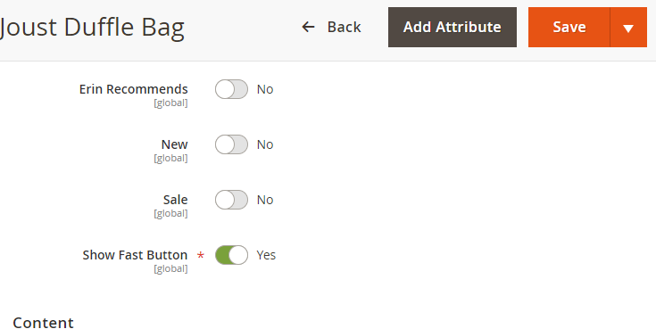
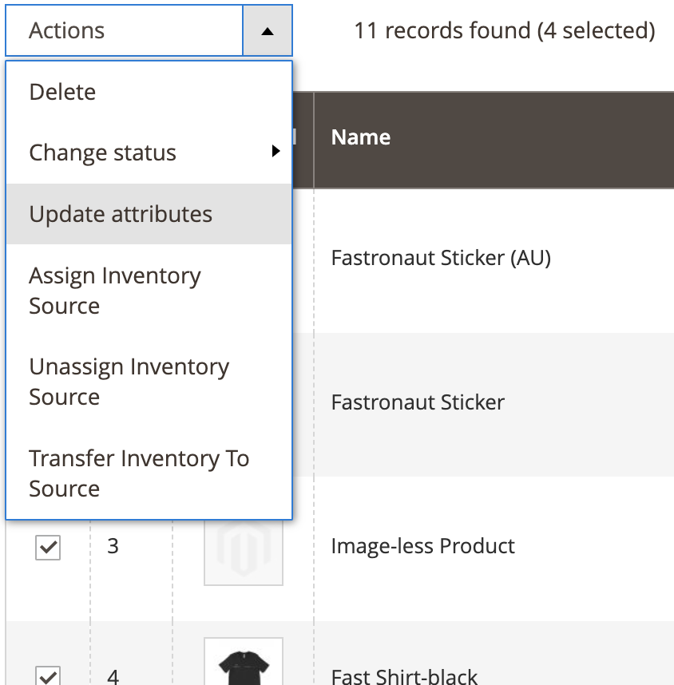
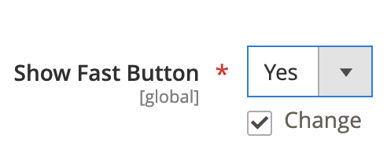

import YouTubeVideoEmbed from "../../../../components/EmbedYouTubeVideo.tsx";
import { Alert, Link } from "@redocly/developer-portal/ui";

# Install step 3: Specify Fast eligible product(s)

By default, products in your Magento inventory list have the Fast Checkout button disabled. This is a configurable product attribute intended to avoid accidentally enabling Fast for products. You can enable Fast Checkout for products individually or in bulk, depending on which products you’d like to enable for Fast Checkout.

The following video shows how to specify Fast products in Magento:

<YouTubeVideoEmbed
  embedId="1sqQlrXwaQs"
  start="97"
  end="139"
  videoTitle="Specify Eligible Products"
/>

## Enable Fast Checkout for Individual Products

1. To enable the Fast Checkout button for individual products, navigate to the products list view at **Catalog -> Products**.
2. Click the product name to navigate to the product attributes page.
3. At the bottom of the list, toggle **Show Fast Button** to Yes.\
   
4. Click **Save**.

## Bulk Enable Fast Checkout for Multiple Products

1. To bulk enable the Fast Checkout button, navigate to the products list view at **Catalog -> Products**.
2. Select the products in the inventory list and click **Actions -> Update products**.\
   
3. In the list of product attributes, change **Show Fast button** to Yes.\
   

:::info Carts with Fast-disabled products
If a customer has a cart that contains one or more Fast-disabled products, the Fast Checkout button will not appear for them on the cart or mini-cart pages.
:::
