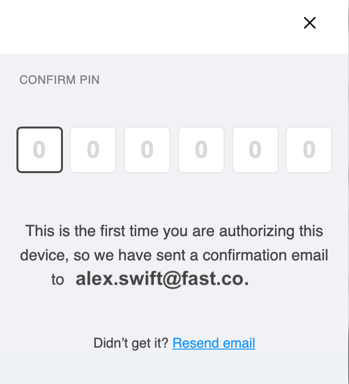
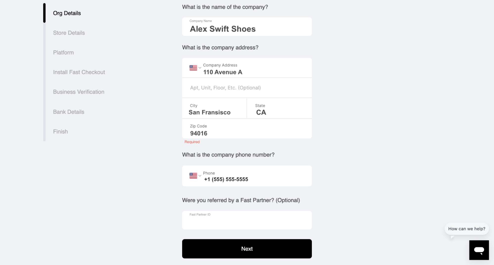

# Pre Install Step 3: Onboard as a Seller

:::info Pro tip

We recommend that you first sign up on https://sdash.sandbox.fast.co/ to create a sandbox account so that you can test your integration with test cards before going live.

:::

## Pin Validation

1. On [fast.co/business](https://www.fast.co/business), enter the following information:”
   - **Your company email address**
     > if you enter in a personal email address or a different email than what you want to use, you can change this later
   - **Your first name**
     > If your business has multiple employees, the person signing up can add other sellers to the Fast account, later, and give other employees permissions.
   - **Your last name**
2. click “Next"
   

3. Fast will now send a PIN number to your email inbox. Open your email to find this PIN number and enter it here on Fast.
   > Note: Fast doesn’t use passwords. We use PIN numbers instead.
   > 

## Fill Out Your Profile

1. On the Org Details page, enter the following information and click “Next”:

   - **Your company name**
   - **Your company address**
   - **Your company phone number**
   - **Your referral number** if you were referred to Fast through a partner (This is optional.)
     

2. On the Store Details page, enter the following information and click “Next”:
   - **Your website domain**
   - **Your company name**
   - **The country where your business is registered**

## Contact Support

At this point we ask you to contact **solutions@fast.co** so we can finish your set up.
