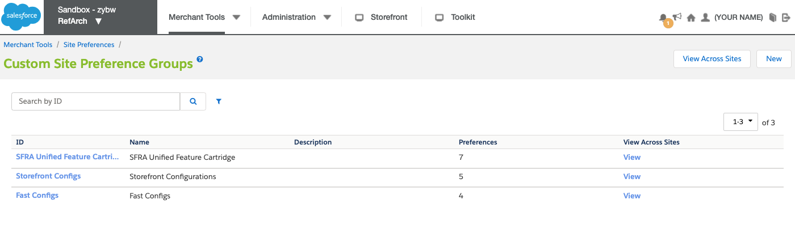
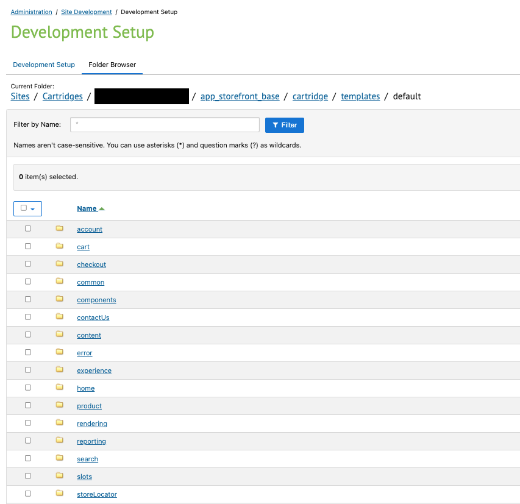

# Install Step 2: Enable Fast Checkout on SFCC

The cartridge includes the necessary code for Fast buttons to appear and work on the following page types without requiring any changes:

- Simple Product Detail Page (PDP)
- Cart

:::info Requirement

Before proceeding with storefront configuration, ensure that you have already [downloaded the Fast Cartridge for SFCC and uploaded it to your storefront](./acquire-extension.md).

:::

The following video section demonstrates how to enable Fast checkout on SFCC:

<iframe
width="560"
height="315"
src="https://www.youtube-nocookie.com/embed/MVnZudopLMI?start=178"
title="YouTube video player"
frameborder="0"
allow="accelerometer; autoplay; clipboard-write; encrypted-media; gyroscope; picture-in-picture"
allowfullscreen>
</iframe>

## Add the cartridge path and metadata

### Add cartridge path

1. Log in to your Commerce Cloud site Business Manager.
2. Activate the previously uploaded `int_fast_sfra` cartridge to the site by adding it to your storefront's Effective Cartridge Path:
   - Navigate to **Administration > Sites > Manage Sites > {site_id} > Settings**
   - Add the cartridge to the **Effective Cartridge Path** field as `int_fast_sfra:app_storefront_base`.
   - Click **Apply**.
     

### Import Fast's metadata XML file to enable custom attributes that support Fast payments.

1. Navigate to **Administration > Site Development > Import & Export**
2. In the _Import & Export Files_ section, click **Upload**, then **Choose File**.
3. Find the `system-objecttype-extensions.xml` under `/metadata/fast-meta-import/meta`.
> For reference, [this is the location of the file](https://github.com/fast-af/sfcc-integration/tree/master/sfcc_cartridge/metadata/fast-meta-import/meta) in Fast's SFCC Integration GitHub repository.

4. Click **Upload**.\
You will see the XML file uploaded in _Manage Import Files_.
5. Navigate back to _Import & Export_, and in the _Meta Data_ section, click **Import**.
    - Select the file that you just imported and click **Next**.
    - Click **Refresh** if you do not see a completed result here.\
    You will see that the XML validation has completed.
    - Click **Import**.
    - In the _Status_ section, click the **Refresh** button.\
    You will see that the imports are successfully completed.

## Add Fast as a payment processor and import payment methods

1. In the Commerce Cloud Business Manager, navigate to **Merchant Tools > Ordering > Payment Processors**.
    - Click **New**.
    - In the _New Payment Processor_ section, enter `FAST_CHECKOUT` for the **ID** and a **Description** such as "Fast Checkout", then click **Apply**.\
  Navigate back to the _Payment Processors_ page, where you will see "Fast Checkout" added to the list.  
2. Navigate to **Merchant Tools > Ordering > Import & Export**.

## Connect to Open Commerce API (OCAPI)

:::info Proceed in Sandbox

Please limit changes to Sandbox configuration settings so that Fast can evaluate your Sandbox configuration before proceeding with changes that will affect your production storefront.

:::

   - **Navigate to**:  
     Administration → Site Development → Open Commerce API Settings
   - **Select Type**: Shop
   - **Select Context**: Global (organization-wide)
     
   - **Paste in the OCAPI configuration file** (provided in JSON format) provided to you by Fast
     > Be sure to update `"client_id":"<<client_id>>"` with the [Client ID you obtained prior to starting the installation process](../pre-install/requirements.md)

5. Open **Fast configuration** settings

   - **Navigate to**:  
     Merchant Tools → Site Preferences → Custom Preferences.
   - **Click on Fast Configs**
     

6. **Enter your Fast configuration details**

   - Set **Instance Type**
     > During initial testing, set Instance Type to "Sandbox". Instance Type should only be changed to "Production" after Fast has evaluated your Sandbox setup and you are ready to go live with your changes
   - Set **FAST JS URL**
     > Sandbox: "https://js.sandbox.fast.co/fast.js"  
     > Production: "https://js.fast.co/fast.js"
   - Set **Is Fast Enabled** option to “Enabled”
     > This is a store-level configuration setting that allows you to quickly enable or disable Fast.
   - Set **Fast App ID**
     > Enter the Sandbox App ID (`app_id`) provided to you previously by Fast
     <embed src="/reusables/for-developers/_fast_app_id.md" />
     > You will not obtain a production `app_id` until your Sandbox setup has been validated by Fast
   - Set **Fast Theme**
     > **ProTip**: Select dark theme if your site has a dark/black background.

   

7. **Save Config**

## Create an OCAPI role and assign it to a Business Manager user

1.

## Display the Fast Checkout storefront button

   - **Add custom code (provided by Fast)** to your storefront's Base ISML files
     > The default storefront Cartridge is normally `app_storefront_base`
   - To **view the current versions of these ISML files**, **Navigate to**:  
     Administration → Site Development → Development Setup → {Code Version} → {Cartridge: `app_storefront_base`} → cartridge templates default
   - **Insert custom code in the following files at locations specified by Fast**:

| File                                                    | Custom Code Content                                                                    |
| ------------------------------------------------------- | -------------------------------------------------------------------------------------- |
| cartridge/templates/default/common/layout/page.isml     | Include the `fast.js` file in the HTML Head of your storefront to enable Fast features |
| cartridge/templates/default/cart/cart.isml              | Include the Fast Checkout button on Cart Pages                                         |
| cartridge/templates/default/checkout/cart/miniCart.isml | Include the Fast Checkout button on Mini-Cart Pages                                    |
| cartridge/templates/default/product/productDetails.isml | Include the Fast Checkout button on Product Detail Pages                               |

## Verify that Fast Checkout is enabled

1.
