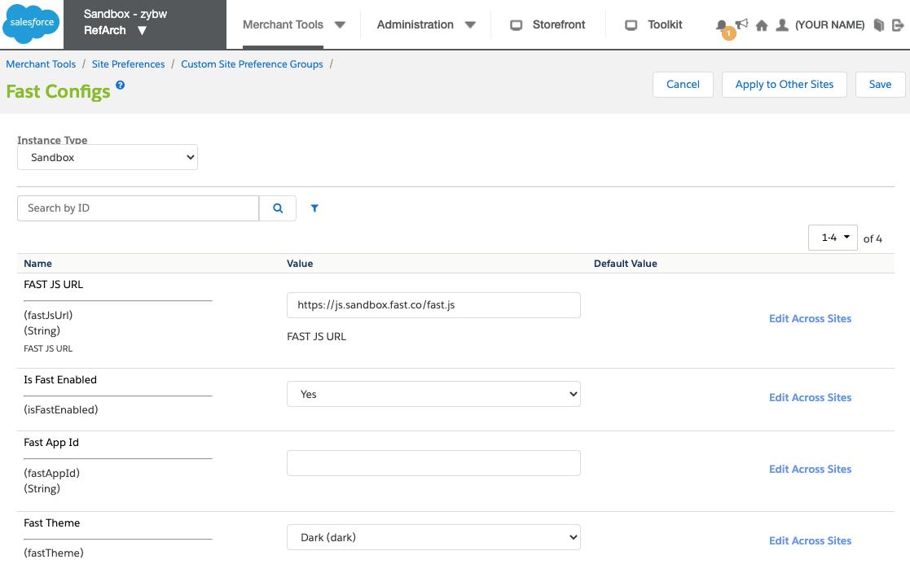

# Install Step 2: Enable Fast Checkout on SFCC

The cartridge includes the necessary code for Fast buttons to appear and work on the following page types without requiring any changes:

- Simple Product Detail Page (PDP)
- Cart

:::info Requirement
Before proceeding with storefront configuration, ensure that you have already [downloaded the Fast Cartridge for SFCC and uploaded it to your storefront](./acquire-extension.md).
:::

The following video section demonstrates how to enable Fast checkout on SFCC:

<iframe
width="560"
height="315"
src="https://www.youtube-nocookie.com/embed/MVnZudopLMI?start=178"
title="YouTube video player"
frameborder="0"
allow="accelerometer; autoplay; clipboard-write; encrypted-media; gyroscope; picture-in-picture"
allowfullscreen>
</iframe>   

## Add the cartridge path to the storefront

1. Log in to your Commerce Cloud site Business Manager.
2. Activate the previously uploaded `int_fast_sfra` cartridge to the site by adding it to your storefront's Effective Cartridge Path:
   - Navigate to **Administration > Sites > Manage Sites > {site_id} > Settings**
   - Add the cartridge to the **Effective Cartridge Path** field as `int_fast_sfra:app_storefront_base`.
   - Click **Apply**.
     

## Import Fast's metadata XML file to enable custom attributes

1. Navigate to **Administration > Site Development > Import & Export**
2. In the _Import & Export Files_ section, click **Upload**, then **Choose File**.
3. Find the `system-objecttype-extensions.xml` under `/metadata/fast-meta-import/meta`.
> For reference, [this is the location of the file](https://github.com/fast-af/sfcc-integration/tree/master/sfcc_cartridge/metadata/fast-meta-import/meta) in Fast's SFCC Integration GitHub repository.

4. Click **Upload**.\
You will see the XML file uploaded in _Manage Import Files_.
5. Navigate back to _Import & Export_, and in the _Meta Data_ section, click **Import**.
    - Select the file that you just imported and click **Next**.
    - Click **Refresh** if you do not see a completed result here.\
    You will see that the XML validation has completed.
    - Click **Import**.
    - In the _Status_ section, click the **Refresh** button.\
    You will see that the imports are successfully completed.

## Add Fast as a payment processor and import payment methods

1. In the Commerce Cloud Business Manager, navigate to **Merchant Tools > Ordering > Payment Processors**.
    - Click **New**.
    - In the _New Payment Processor_ section, enter `FAST_CHECKOUT` for the **ID** and a **Description** such as "Fast Checkout", then click **Apply**.\
  Navigate back to the _Payment Processors_ page, where you will see "Fast Checkout" added to the list.  
2. Navigate to **Merchant Tools > Ordering > Import & Export**.
3. Click **Upload**, then locate the `payment-methods.xml` file from **SFCC cartridge location > metadata > fast-meta-import > sites > RefArch**. Upload the file.
4. Navigate back to **Merchant Tools > Ordering > Import & Export**, and click **Import** under the _Payment Methods_ section.
5. Complete the import steps to add the Fast payment method.

## Create a Business Manager user

The Business Manager user in the storefront is needed to connect the Open Commerce API (OCAPI) to Fast.

1. Navigate to **Administration > Users**. If you have the correct permissions you will see a **Create Users** button here.
2. Follow the instructions [described here](https://trailhead.salesforce.com/content/learn/modules/b2c-configure-users-roles-permissions/b2c-admin-configure-business-manager-users) to create a new user.

## Connect to Open Commerce API (OCAPI)

:::info Proceed in Sandbox

Please limit changes to Sandbox configuration settings so that Fast can evaluate your Sandbox configuration before proceeding with changes that will affect your production storefront.

:::

### Create an API client for Fast

1. In the SFCC Account Manager, go to the **API Client** tab, and click **Add API Client**.
2. The Fast delivery team will use this information to generate a Fast App ID (`app_id`) for you.

### Configure Fast Checkout button Settings

1. Navigate to **Merchant Tools > Custom Preferences > Fast Configs**. You will see a number of existing preferences.\

2. Set the following values:
    - **Instance Type** - during initial testing, set Instance Type to "Sandbox". Instance Type should only be changed to "Production" after Fast has evaluated your Sandbox setup and you are ready to go live with your changes.
    - **Fast JS URL**:
      - Sandbox: "https://js.sandbox.fast.co/fast.js"
      - Production: "https://js.fast.co/fast.js"
    - **Fast Enabled** - set to "Enabled".\
    This is a store-level setting that allows you to quickly enable or disable Fast.
    - **Fast App ID** - enter the Sandbox App ID (`app_id`) provided to you previously by Fast.\
    You must have already [created an API client](#create-an-api-client-for-fast) so that the Fast Delivery Team can generate a Fast App ID (or Sandbox App ID) for your store. You will not obtain a production `app_id` until your Sandbox setup has been validated by Fast.\
    <embed src="/reusables/for-developers/_fast_app_id.md" />
    - **Fast Theme** - if you set the theme to Dark, it will make the button appear white.
    
3. Click **Save Config**.

### Update the Open Commerce API (OCAPI) settings

1. Navigate to **Administration > Site Development > Open Commerce API Settings**.
2. In your SFCC cartridge folder, open the file `fast-checkout-ocapi-settings.txt`.
3. Copy this file and paste the contents in the _Open Commerce API Settings_ page.
4. Replace the `client_id` variable with your Fast App ID.
5. Click **Save**.

### Create an OCAPI role and assign it to your Business Manager user

1. Navigate to **Administration > Roles & Permissions** and click **New** to create a new role.
2. For **ID** call the role "Fast OCAPI", enter something similar for the **Description**, then click **Apply**.
3. In the _Functional Permissions_ tab for that user, select the Site "RefArch" permission level and click **Apply**.  
4. Select the following three permissions for the role:
    - `Create_Order_On_Behalf_Of`
    - `Search_Orders`
    - `Handle_External_Orders`
5. Click **Update**.
6. In the _Locale Permissions_ tab for the user, assign them with Write permissions for all locales, then click **Update**.
7. In the _Users_ tab for the user, click **Assign** to assign your Fast OCAPI user to the role.

## Display the Fast Checkout storefront button

1. Download the storefront code:
    1. Navigate to **Administration > Site Development > Code Deployment**.
    2. Click your active version, indicated with a green checkmark.
    3. Click **Download**.
    4. Open the downloaded code in VS Code.
2. Insert the relevant code snippets in the following file locations:

| File                                                    | Custom Code Content                                                                    |
| ------------------------------------------------------- | -------------------------------------------------------------------------------------- |
| `cartridge/templates/default/common/layout/page.isml `    | Include the `fast.js` file in the HTML Head of your storefront to enable Fast features |
| `cartridge/templates/default/cart/cart.isml `             | Include the Fast Checkout button on Cart Pages                                         |
| `cartridge/templates/default/checkout/cart/miniCart.isml` | Include the Fast Checkout button on Mini-Cart Pages                                    |
| `cartridge/templates/default/product/productDetails.isml` | Include the Fast Checkout button on Product Detail Pages                               |\
:::info Fast delivery code insertions
This information should be provided to you in detail by the Fast Delivery team.

The following video section also demonstrates how to insert the code to display the Fast Checkout button:
<iframe
width="560"
height="315"
src="https://www.youtube-nocookie.com/embed/MVnZudopLMI?start=534&end=608"
title="YouTube video player"
frameborder="0"
allow="accelerometer; autoplay; clipboard-write; encrypted-media; gyroscope; picture-in-picture"
allowfullscreen>
</iframe>   
:::\
3. Once the code has been added, navigate to your Prophet Debugger similarly to when you [first added the Fast cartridge](./acquire-extension.md#option-2-using-the-prophet-debugger-visual-studio-code-extension), and click the **Upload** button to upload all of the files.

:::success Verify the Fast Checkout button
At this point the Fast Checkout button should be accessible from your storefront. Test it by running a sample order, and you will see the button appearing on the page.
:::
