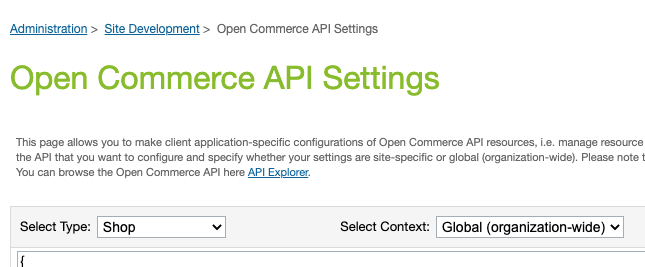

# Install Step 2: Enable Fast Checkout on SFCC

The cartridge includes the necessary code for Fast buttons to appear and work on the following pages without requiring any changes:

- Simple Product Detail Page (PDP)
- Cart

:::info SFCC SFRA Cartridge Installation and Upload Requirement

Before proceeding with storefront configuration, ensure you have already [downloaded the Fast Cartidge for SFCC and uploaded it to your storefront](./acquire-extension).

:::

## Configuration

- Install the Cartidge Sandbox environment with credentials Fast will provide
  Select theme appropriate for store-front design (default or dark)
  Select Products to enable Fast Checkout

1. **Log in to your Commerce Cloud site** with your Business Manager credentials.
2. Activate the previously uploaded `int_fast_sfra` Cartridge to the site by adding it to your strorefont's **Effective Cartridge Path**.
   - Navigate to:  
     Administration → Sites → Manage Sites → {site_id} → Settings
   - In the Setting tab, add `int_fast_sfra` to the Effective Cartridge Path (e.g. `int_fast_sfra:app_storefront_base`, as Cartridge names must be provided as a colon-separated list)
     
   - Click "Apply"
3. **Import a Fast's metadata XML file** to enable custom attributes set up to support Fast payments.
   - Administration → Site Development → Import & Export → Manage Import Files
     - Find the `system-objecttype-extensions.xml` under `/metadata/fast-meta-import/meta`
     - For reference, this is the location of the file in Fast's SFCC Integration Github repository:  
       https://github.com/fast-af/sfcc-integration/tree/master/sfcc_cartridge/metadata/fast-meta-import/meta

:::warning Proceed in Sandbox

Please limit changes to Sandbox configuration settings so that Fast can evaluate your Sandbox configuration before proceeding with changes that will affect your production storefront.

:::

4. **Connect to OCAPI**
   - Navigate to:  
     Administration → Site Development → Open Commerce API Settings
   - Select Type: Shop
   - Select Context: Global (organization-wide)
     
   - Paste in the OCAPI configutation file (provided in JSON format) provided to you by fast
   - Be sure to update `"client_id":"<<client_id>>"` with the [Client ID you obtained prior to starting the installation process](../pre-install/requirements).)

provdided

4. Open **Fast configuration** settings

   - Navigate to:  
     Merchant Tools → Site Preferences → Custom Preferences.
   - Click on **Fast Configs**
     

5. **Enter your Fast configuration details**

   - Set **Instance Type**
   - During initial testing, set to "Sandbox"
   - Instance Type should only be changed to "Production" after Fast has evaluated your Sandbox setup and you are ready to go live with your changes
   - Set **FAST JS URL**
   - Sandbox: `https://js.sandbox.fast.co/fast.js`
   - Production: `https://js.fast.co/fast.js`
   - Set **Is Fast Enabled** option to “Enabled”
   - This is a store-level configuration setting that allows you to quickly enable or disable Fast.
   - Set **Fast App ID**
   - Enter the Sandbox App ID (`app_id`) prodivded to you previously by Fast
   - You will not obtain a production `app_id` until your Sandbox setup has been validated by Fast
   - Set **Fast Theme**
   - Select dark theme if your site has a dark/black background.
     ./images/image4.png)

6. **Save Config**

7. **Implement Custom Code to Display the Fast Checkout Button**
   - You will need to add custom code (proivided by Fast) to your storefront's Base ISML files
   - The default storefront Cartridge is normally `app_storefront_base`
   - To view the current versions of these ISML files Navigate to:  
     Administration → Site Development → Development Setup → {Code Version} → {Cartridge: `app_storefront_base`} → cartridge templates default
   - When you have completed other configuration steps, you will need to insert custom code in the following files at locations specified by Fast:
     - cartridge/templates/default/common/layout/page.isml
       - To include the `fast.js` file in the HTML Head of your storefront to enable Fast features
     - cartridge/templates/default/cart/cart.isml
       - To include the Fast Checkout button on Cart Pages
     - cartridge/templates/default/checkout/cart/miniCart.isml
       - To include the Fast Checkout button on Mini-Cart Pages
     - cartridge/templates/default/product/productDetails.isml
     - To include the Fast Checkout button on Product Detail Pages
       
