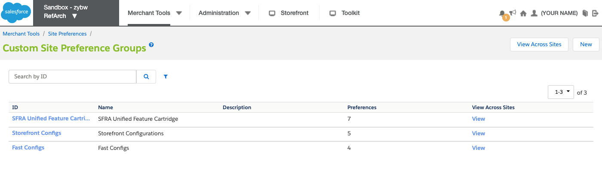
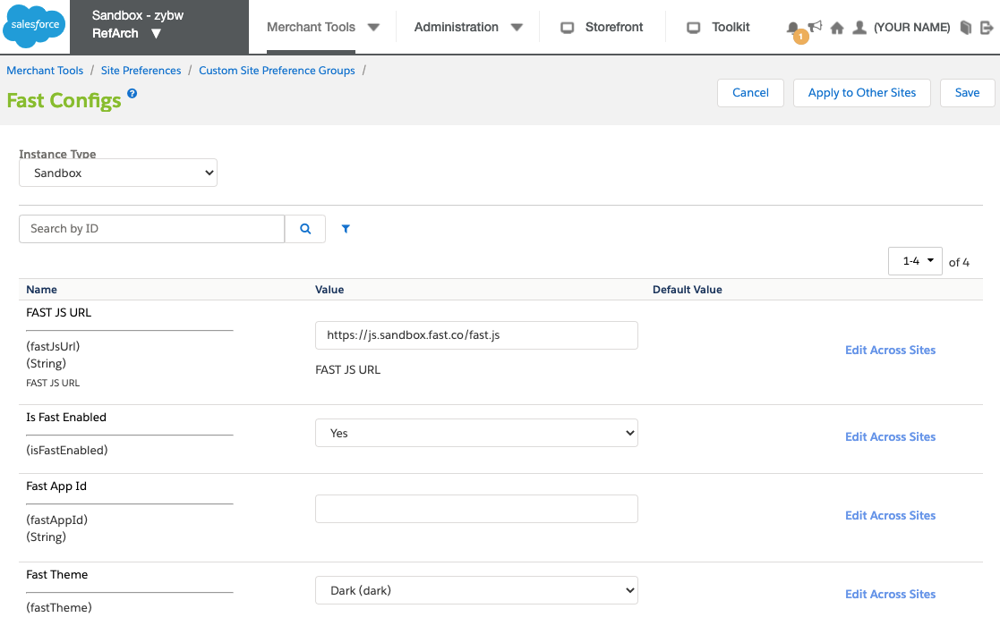
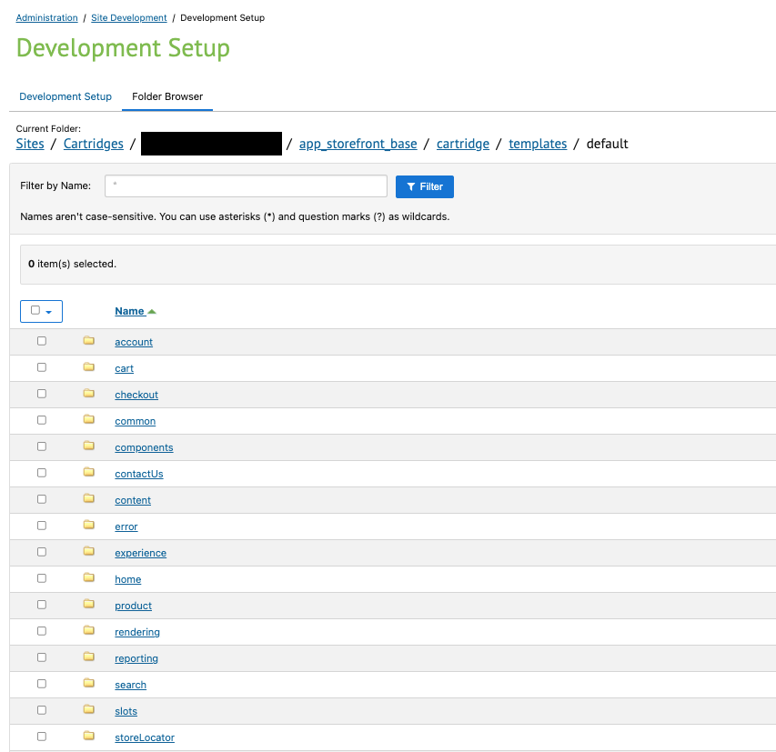

import YouTubeVideoEmbed from "../../../../components/EmbedYouTubeVideo.tsx";
import { Alert, Link } from "@redocly/developer-portal/ui";

# Install Step 2: Enable Fast Checkout on SFCC

The cartridge includes the necessary code for Fast buttons to appear and work on the following pages without requiring any changes:

- Simple Product Detail Page (PDP)
- Cart

<Alert variant="attention" header="Fast Cartridge Requirement">
  {" "}
  Before proceeding with storefront configuration, ensure you have already <Link to="./acquire-extension.mdx">
    downloaded the Fast Cartridge for SFCC and uploaded it to your storefront
  </Link>.
</Alert>

## Configuration

1. **Log in to your Commerce Cloud site** with your Business Manager credentials.
2. Activate the previously uploaded `int_fast_sfra` Cartridge to the site by adding it to your storefront's **Effective Cartridge Path**.
   - **Navigate to**:  
     Administration → Sites → Manage Sites → {site_id} → Settings
   - In the Settings tab, **add `int_fast_sfra` to the Effective Cartridge Path** (e.g. `int_fast_sfra:app_storefront_base`, as Cartridge names must be provided as a colon-separated list)
     
   - **Click "Apply"**
   - The following video outlines how to update the effective Cartridge path:
     <YouTubeVideoEmbed
       embedId="MVnZudopLMI"
       start="178"
       end="210"
       videoTitle="Add Fast Cartridge Path"
     />
3. **Import Fast's metadata XML file** to enable custom attributes that support Fast payments.
   - **Navigate to**:  
     Administration → Site Development → Import & Export → Manage Import Files
     - Find the `system-objecttype-extensions.xml` file under `/metadata/fast-meta-import/meta`
       > For reference, this is the location of the file in [Fast's SFCC Integration GitHub repository](https://github.com/fast-af/sfcc-integration/tree/master/sfcc_cartridge/metadata/fast-meta-import/meta).
     - The following video outlines how to update the effective Cartidge path:
       <YouTubeVideoEmbed
         embedId="MVnZudopLMI"
         start="210"
         end="279"
         videoTitle="Import Custom Attributes"
       />

<Alert variant="attention" header="Proceed in Sandbox">
  {" "}
  Please limit changes to Sandbox configuration settings so that Fast can evaluate
  your Sandbox configuration before proceeding with changes that will affect your
  production storefront.
</Alert>

4. **Add Fast as a Payment Processor**

   - **Navigate to**:  
     Merchant Tools → Ordering → Payment Processors
   - Click "New" to add a new payment processor
     - Set `ID` as "FAST_CHECKOUT"
     - (Optional) Provide additional details in `Description`
     - Click "Apply" to save your changes
   - **Navigate to**:  
     Merchant Tools → Ordering → Import & Export
     - Under "Import & Export Files" click "Upload"
     - Click "Choose a File"
     - Select the previously-downloaded Cartidge file
     - Find the `payment-methods.xml` file under `/metadata/fast-meta-import/sites/RefArch`
     - Click "Upload"
   - **Navigate back to**:  
     Merchant Tools → Ordering → Import & Export
     - Under "Payment Methods" click "Import"
     - Select `payment-methods.xml` and click "Next"
       - on the next screen, click "Refresh" to confirm the import has been validated
     - Click "Next"
     - Select the appropriate import mode ("MERGE" is default)
     - Click "Import"
   - The following video outlines how to Add Fast as a Payment Processor:
     {" "}
     <YouTubeVideoEmbed
       embedId="MVnZudopLMI"
       start="279"
       end="359"
       videoTitle="Add Fast API Client in Account Manager"
     />

5. **Create a Business Manager User** in your storefront

   - **Navigate to**:  
     Administration → Organization → Users
   - Click "New" to create a new user profile
   - The following video outlines how to Fast as a Payment Processor:
     <YouTubeVideoEmbed
       embedId="MVnZudopLMI"
       start="359"
       end="380"
       videoTitle="Create a Business Manager User"
     />

6. **Add Fast API Client** in Account Manager

   - **Navigate to**:  
     Account Manager → API Client
   - Click "Add API Client"
     
   - The API Client ID and Password produced during this step will be used by your Fast Delivery Team to generate a Sandbox App ID (`app_id`) for your store.
   - The following video outlines how to add an API Client in Account Manager:
     <YouTubeVideoEmbed
       embedId="MVnZudopLMI"
       start="380"
       end="397"
       videoTitle="Add Fast API Client in Account Manager"
     />

7. Adjust your **Fast configuration** settings

   - **Navigate to**:  
     Merchant Tools → Site Preferences → Custom Preferences.
   - **Click on Fast Configs**
     

   - **Enter your Fast configuration details**

     - Set **Instance Type**
       - During initial testing, set Instance Type to "Sandbox". Instance Type should only be changed to "Production" after Fast has evaluated your Sandbox setup and you are ready to go live with your changes
     - Set **FAST JS URL**
       - Sandbox: "https://js.sandbox.fast.co/fast.js"  
       - Production: "https://js.fast.co/fast.js"
     - Set **Is Fast Enabled** option to “Enabled”
       - This is a store-level configuration setting that allows you to quickly enable or disable Fast.
     - Set **Fast App ID**
       - Enter the Sandbox App ID (`app_id`) provided to you previously by Fast.
         <Alert
           variant="attention"
           header="Fast API Client Prerequisite Step"
           content='You must first complete the "Add Fast API Client" step above so that the Fast Delivery Team can generate a Sandbox App ID for your store.'
         />
         <embed src="/reusables/for-developers/_fast_app_id.md" />
       - You will not obtain a production `app_id` until your Sandbox setup has been validated by Fast
     - Set **Fast Theme**
       
     - Click **Save Config**
     - The following video outlines how to configure Fast Checkout from the "Fast Configs" settings page:
       <YouTubeVideoEmbed
         embedId="MVnZudopLMI"
         start="397"
         end="444"
         videoTitle="Configure Fast Checkout"
       />

8. **Update Open Commerce API (OCAPI) Settings**

   - **Navigate to**:  
     Administration → Site Development → Open Commerce API Settings
   - **Select Type**: Shop
   - **Select Context**: Global (organization-wide)
     
   - **Paste in the OCAPI configuration file** (provided in JSON format) available in the Cartridge
   - The will be named `fast-checkout-ocapi-settings.txt`
     > Be sure to update `"client_id":"<<client_id>>"` with the [Client ID you obtained prior to starting the installation process](../pre-install/requirements.md)
   - The following video outlines how to Add the Fast API Client in Account Manager:
     <YouTubeVideoEmbed
       embedId="MVnZudopLMI"
       start="444"
       end="485"
       videoTitle="Update Open Commerce API (OCAPI) Settings"
     />

9. **Create an OCAPI Role and Assign to Business Manager User**

   - **Navigate to**:  
     Administration → Roles & Permissions
   - Click "New" to create a new role
     - Set `ID` for the new role (e.g. "Fast OCAPI")
     - (Optional) Provide additional details in `Description`
     - Click "Apply" to save your changes
   - Update the permissions for the role

   - **Navigate to "Functional Permissions" tab**:  
     - Select the relevant site(s) the role should apply to and grant the following functional permissions:
     - `Create_Order_On_Behalf_Of`
     - `Search_Orders`
     - `Handle_External_Orders`
     - Click "Update" to save your changes
   - **Navigate to "Locale Permissions" tab**:  
     - Select all available locales the role should apply to
     - Click "Update" to save your changes
   - **Navigate to "Users" tab**:  
     - Click "Assign" to pull up a list of Business Manager users.
     - Assign the newly-created role to the Business Manager role created in a previous step.
     - Click "Update" to save your changes.
   - The following video outlines how to Add the Fast API Client in Account Manager:
     <YouTubeVideoEmbed
       embedId="MVnZudopLMI"
       start="485"
       end="534"
       videoTitle="Update Open Commerce API (OCAPI) Settings"
     />

10. **Implement Custom Code to Display the Fast Checkout Button**

    - **Add custom code (provided by Fast)** to your storefront's Base ISML files
      > The default storefront Cartridge is normally `app_storefront_base`
    - To **view the current versions of these ISML files**, **Navigate to**:  
      Administration → Site Development → Development Setup → {Code Version} → {Cartridge: `app_storefront_base`} → cartridge → templates → default

      

        

          <h4>Click here to view Folder Browser screenshot</h4>
        

        

          
        

      

    - **Insert custom code in the following files at locations specified by Fast**:

      | File                                                      | Custom Code Content                                                                    |
      | --------------------------------------------------------- | -------------------------------------------------------------------------------------- |
      | `cartridge/templates/default/common/layout/page.isml`     | Include the `fast.js` file in the HTML Head of your storefront to enable Fast features |
      | `cartridge/templates/default/cart/cart.isml`              | Include the Fast Checkout button on Cart Pages                                         |
      | `cartridge/templates/default/checkout/cart/miniCart.isml` | Include the Fast Checkout button on Mini-Cart Pages                                    |
      | `cartridge/templates/default/product/productDetails.isml` | Include the Fast Checkout button on Product Detail Pages                               |

    - The following video outlines how to enable Fast Checkout for your storefront:
      <YouTubeVideoEmbed
        embedId="MVnZudopLMI"
        start="534"
        end="608"
        videoTitle="Enable Fast Checkout"
      />
