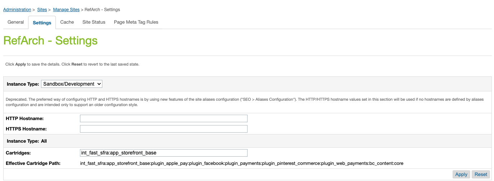
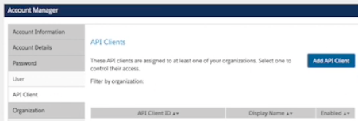
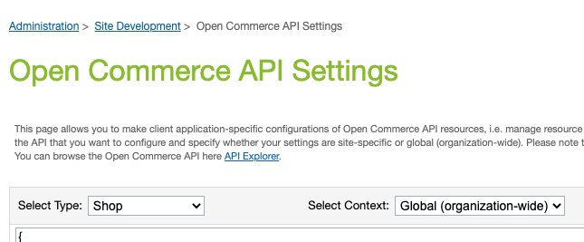

import YouTubeVideoEmbed from "../../../../components/EmbedYouTubeVideo.tsx";
import { Alert, Link } from "@redocly/developer-portal/ui";

# Install Step 2: Enable Fast Checkout on SFCC

The cartridge includes the necessary code for Fast buttons to appear and work on the following pages without requiring any changes:

- Simple Product Detail Page (PDP)
- Cart

:::info Fast Cartridge Requirement
Before proceeding with storefront configuration, ensure that you have already [downloaded the Fast Cartridge for SFCC and uploaded it to your storefront](./acquire-extension.mdx).
:::

## Add the cartridge path to the storefront

1. **Log in to your Commerce Cloud site** with your Business Manager credentials.
2. Activate the previously uploaded `int_fast_sfra` Cartridge to the site by adding it to your storefront's **Effective Cartridge Path**.
   - **Navigate to**:  
     Administration → Sites → Manage Sites → {site_id} → Settings
   - In the Settings tab, **add `int_fast_sfra` to the Effective Cartridge Path** (e.g. `int_fast_sfra:app_storefront_base`, as Cartridge names must be provided as a colon-separated list)
     
   - **Click "Apply"**
3. The following video outlines how to update the effective Cartridge path:
   <YouTubeVideoEmbed
     embedId="MVnZudopLMI"
     start="178"
     end="210"
     videoTitle="Add Fast Cartridge Path"
   />

## Import Fast's metadata XML file to enable custom attributes

1. Navigate to **Administration > Site Development > Import & Export > Manage Import Files**
2. In the _Import & Export Files_ section, click **Upload**, then **Choose File**.
3. Find the `system-objecttype-extensions.xml` under `/metadata/fast-meta-import/meta`.
   - For reference, this is the location of the file in [Fast's SFCC Integration GitHub repository](https://github.com/fast-af/sfcc-integration/tree/master/sfcc_cartridge/metadata/fast-meta-import/meta).
4. Click **Upload**.
   - You should see the XML file uploaded in _Manage Import Files_.
5. Navigate back to _Import & Export_ > _Meta Data_ section.
   - Click **Import**.
   - Select the file that you just imported and click **Next**.
   - You should see that the XML validation has completed.
     - Click **Refresh** if you do not see a completed result here.
   - Click **Import**.
   - You should see that the imports have successfully completed.
     - Click **Refresh** in the _Status_ section if you do not see a successful import status.
6. The following video outlines how to import custom attributes:
   <YouTubeVideoEmbed
     embedId="MVnZudopLMI"
     start="210"
     end="279"
     videoTitle="Import Custom Attributes"
   />

:::info Proceed in Sandbox

Please limit changes to Sandbox configuration settings so that Fast can evaluate your Sandbox configuration before proceeding with changes that will affect your production storefront.

:::

## Add Fast as a payment processor and import payment methods

1. In the Commerce Cloud Business Manager, navigate to **Merchant Tools > Ordering > Payment Processors**.
   - Click **New**.
   - In the _New Payment Processor_ section, enter `FAST_CHECKOUT` for the **ID** and a **Description** such as "Fast Checkout", then click **Apply**.
     - Navigate back to the _Payment Processors_ page, where you should see "Fast Checkout" added to the list.
2. Navigate to **Merchant Tools > Ordering > Import & Export**.
   - Click **Upload**
   - Select the previously downloaded Cartridge file
   - Within the Cartridge, go to `/metadata/fast-meta-import/sites/RefArch` and select the `payment-methods.xml` file.
   - Click "Upload" to upload the file.
3. Navigate back to **Merchant Tools > Ordering > Import & Export**
   - Click **Import** under the _Payment Methods_ section.
   - Select `payment-methods.xml` and click "Next."
     - on the next screen, click "Refresh" to confirm the import has been validated.
   - Click "Next"
   - Select the appropriate import mode ("MERGE" is default)
   - Click "Import"
4. The following video outlines how to Add Fast as a Payment Processor:
   <YouTubeVideoEmbed
     embedId="MVnZudopLMI"
     start="279"
     end="359"
     videoTitle="Add Fast API Client in Account Manager"
   />

## Create a Business Manager user for your storefront

A Business Manager user is needed to connect the Open Commerce API (OCAPI) to Fast.

1. Navigate to **Administration > Users**.
   - If you have the proper permissions you should see a **Create Users** button here.
2. Follow the instructions [described here](https://trailhead.salesforce.com/content/learn/modules/b2c-configure-users-roles-permissions/b2c-admin-configure-business-manager-users) to create a new user.
3. The following video outlines how to create a Business Manager User for our storefront:
   <YouTubeVideoEmbed
     embedId="MVnZudopLMI"
     start="359"
     end="380"
     videoTitle="Create a Business Manager User"
   />

### Create an API client for Fast

1. In the SFCC Account Manager, go to the **API Client** tab, and click **Add API Client**.
   

2. The API Client ID and Password produced during this step will be used by your Fast Delivery Team to generate a Sandbox App ID (`app_id`) for your store.

3. The following video outlines how to add an API Client in Account Manager:
   <YouTubeVideoEmbed
     embedId="MVnZudopLMI"
     start="380"
     end="397"
     videoTitle="Add Fast API Client in Account Manager"
   />

### Configure Fast Checkout button settings

1. Navigate to **Merchant Tools > Custom Preferences > Fast Configs**.
   - You should see a number of existing preferences.
     
2. Set the following values:
   - **Instance Type**:
     - During initial testing, set Instance Type to "Sandbox".
     - Instance Type should only be changed to "Production" after Fast has evaluated your Sandbox setup and you are ready to go live with your changes.
   - **Fast JS URL**:
     - Sandbox: "https://js.sandbox.fast.co/fast.js"
     - Production: "https://js.fast.co/fast.js"
   - **Fast Enabled**:
     - Set to "Enabled."
     - This is a store-level setting that allows you to quickly enable or disable Fast.
   - **Fast App ID**:
     - Enter the Sandbox App ID (`app_id`) provided to you previously by Fast.
     - You must have already [created an API client](#create-an-api-client-for-fast) so that the Fast Delivery Team can generate a Sandbox App ID for your store. You will not obtain a production Fast App ID (`app_id`) until your Sandbox setup has been validated by Fast.
       <embed src="/reusables/for-developers/_fast_app_id.md" />
   - **Fast Theme**:
     - If you set the theme to Dark, it will make the button appear white.
       
3. Click **Save Config**.
4. The following video outlines how to configure Fast Checkout from the "Fast Configs" settings page:
   <YouTubeVideoEmbed
     embedId="MVnZudopLMI"
     start="397"
     end="444"
     videoTitle="Configure Fast Checkout"
   />

### Update the Open Commerce API (OCAPI) settings

1. Navigate to **Administration > Site Development > Open Commerce API Settings**.
   - **Select Type**: Shop
   - **Select Context**: Global (organization-wide)
     
2. In your SFCC cartridge folder, open the file `fast-checkout-ocapi-settings.txt`.
3. Copy and paste the contents of the file in the _Open Commerce API Settings_ page.
   - Replace the `"client_id":"<<client_id>>"` with the [Client ID you obtained prior to starting the installation process](../pre-install/requirements.md).
4. Click **Save**.
5. The following video outlines how to Update OCAPI Settings:
   <YouTubeVideoEmbed
     embedId="MVnZudopLMI"
     start="444"
     end="485"
     videoTitle="Update Open Commerce API (OCAPI) Settings"
   />

### Create an OCAPI role and assign it to your Business Manager user

1. Navigate to **Administration > Roles & Permissions**
   - Click **New** to create a new role.
2. For **ID** call the role "Fast OCAPI"
   - Enter additional details for the **Description**.
   - Click **Apply** to save your changes.
3. Navigate to the the _Functional Permissions_ tab
   - Select the Site "RefArch" permission level.
   - Click **Apply**.
4. Select the following three permissions for the role:
   - `Create_Order_On_Behalf_Of`
   - `Search_Orders`
   - `Handle_External_Orders`
5. Click **Update**.
6. Navigate to the the _Locale Permissions_ tab
   - Assign Write permissions for all locales
7. Click **Update**.
8. Navigate to the the _Users_ tab
   - Click **Assign** to pull up a list of Business Manager users
   - Assign the "Fast OCAPI" role to the Business Manager user created in a [previous step](#create-a-business-manager-user-for-your-storefront).
9. Click **Update**.
10. The following video outlines how to an OCAPI role and assign it to your Business Manager user:
    <YouTubeVideoEmbed
      embedId="MVnZudopLMI"
      start="485"
      end="534"
      videoTitle="Create an OCAPI Role and Assign to Business Manager User"
    />

## Add Custom Code to Display the Fast Checkout button

:::attention Fast delivery code insertions
All of these steps should be provided to you in detail by the Fast Delivery team.
:::

1. Download the storefront code:
   1. Navigate to **Administration > Site Development > Code Deployment**.
   2. Click your active version, indicated with a green checkmark.
   3. Click **Download**.
   4. Open the downloaded code in your preferred text editor or IDE (e.g. VS Code).
2. Insert the relevant code snippets in the following file locations:

   | File                                                      | Custom Code Content                                                                    |
   | --------------------------------------------------------- | -------------------------------------------------------------------------------------- |
   | `cartridge/templates/default/common/layout/page.isml`     | Include the `fast.js` file in the HTML Head of your storefront to enable Fast features |
   | `cartridge/templates/default/cart/cart.isml`              | Include the Fast Checkout button on Cart Pages                                         |
   | `cartridge/templates/default/checkout/cart/miniCart.isml` | Include the Fast Checkout button on Mini-Cart Pages                                    |
   | `cartridge/templates/default/product/productDetails.isml` | Include the Fast Checkout button on Product Detail Pages                               |

3. Once the code has been added, navigate to your Prophet Debugger (similar to when you [first added the Fast cartridge](./acquire-extension.mdx#option-2-using-the-prophet-debugger-visual-studio-code-extension)), and click the **Upload** button to upload all of the updated files.

:::success Verify the Fast Checkout button
At this point you should be able to view the Fast Checkout button on your storefront's product pages and also be able to test Fast Checkout with a sample order.
:::

4. The following video section also demonstrates how to insert the custom code necessary to display the Fast Checkout button for your storefront:
   <YouTubeVideoEmbed
     embedId="MVnZudopLMI"
     start="534"
     end="608"
     videoTitle="Add the Fast Button to the Storefront Code"
   />
