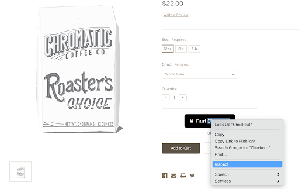
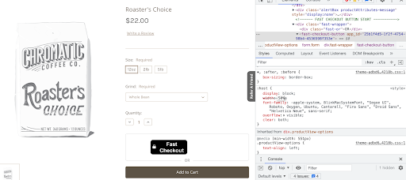
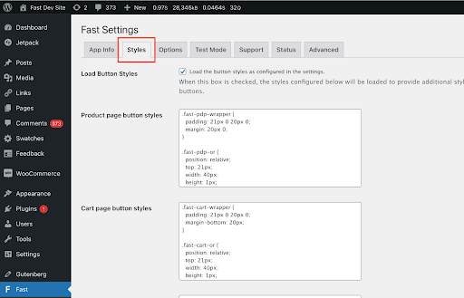
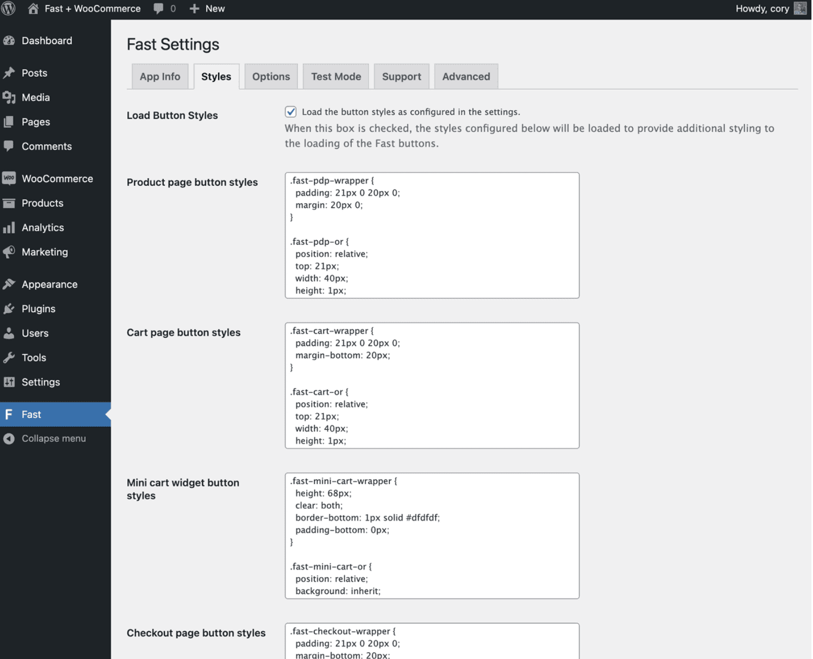

# Custom Button Styling

1. On your online store, **control-click/right-click the Fast button and click “Inspect”**.

2. In the code that appears (in the inspector), **click `
` or one of the lines below that line**.

3. In the styling box below, **make adjustments to the width or font size or anything else you want to change**.
   > Keep adjusting until the Fast button and the other elements around it appear exactly how you want it.

4. Once you know that you like the Fast button to have a certain styling feature, like a certain width or font size, **go to the “Styles tab” on the WooCommerce page**.

5. **Figure out which textbox in WooCommerce corresponds to the page you’re trying to adjust**. For example, if you want to adjust styling on the product page, you’ll want to use the “Product page button styles” textbox. Similarly, if you want to adjust the styling on the mini cart page, you’ll want to use the “Mini cart widget button styles” textbox.

6. **In the corresponding textbox, take the change you made directly on the online store and apply that change here**. For example, if you made the width 40px directly on the online store, then find where it says “width” in the corresponding textbox and change the width in that textbox to 40px.

7. **Click “Save Changes”**.
8. **Go into your online store again to see if the Fast button now looks good**. You may have to refresh the page a few times before the new version of the Fast button appears. If you still want to make changes, repeat this process until the Fast button looks good.
