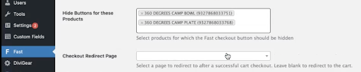
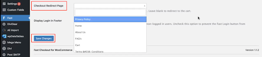

# Custom settings

## Hiding Fast Button

You might have products in your store where it wouldn’t make sense for customers to use one-click checkout, like a subscription-based purchase or a customized product.

If, for any specific products, you want to hide the Fast button"

1.  Go to the “Options” tab.
2.  For each product where you don’t want one-click checkout, type that product name into the “Hide Buttons for these Products” textbox. Once you begin typing, the system will autocomplete the rest.
3.  Add in as many products as you want.
4.  click “Save Changes.”

## Redirects

Normally, after a shopper checks out using the Fast button, they are NOT redirected to any particular page. If you want shoppers to be redirected to a specific page after they use the Fast button:

1. Go to the “Options tab.”
2. Enter which page you want customers to be redirected to in the “Checkout Redirect Page” textbox. For example, if you want shoppers to be brought to an order confirmation page after they use the Fast button, type in “Order Confirmation page” here.
3. Click “Save Changes.”

## Display Fast Login Button in Footer

We recommend you uncheck “Display Fast Login Button in Footer” under the “Options tab” because this often makes the page look odd.

However, if you really want non-logged in users to see the Fast Login Button in the footer and you can do styling to make it look good, then keep this checked.

To adjust this styling, follow the steps in the section, [Styling the Buttons](/developer-portal/for-developers/woocommerce/custom-styling/custom-checkout-button-styling/), and apply the styling changes to the “Login button style” textbox in WooCommerce.

