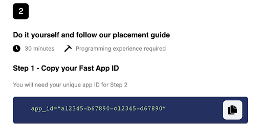
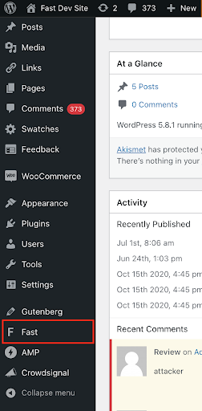
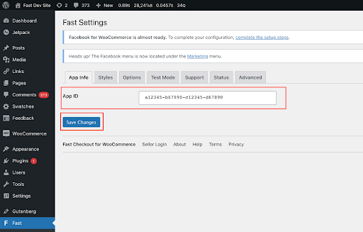

# Step 1: Install Fast Plugin

## Install Fast Checkout for WooCommerce Plugin for the First Time

<embed src="/reusables/for-developers/_platform_woocommerce_wordpress_plugin_initial_install" />

:::info Migrating a Manually Installed Plugin Version to Wordpress Plugin Directory Version

If currently have a manually-installed version of the plugin (e.g. installed by the Fast Customer Success Team before the Wordpress Plugin Directory version was available) please visit the [**Migrating Fast to New Plugin Directory Version (for Early Sellers)** page](../wordpress-plugin/migrating) for migration instructions.

:::

# Connect Your Fast App ID to the Fast Plugin

1. **Login to the admin dashboard of your WordPress site.** (If you are proceeding logged in)

   > The url for this is usually `https://yourwebsite.com/wp-admin`

2. While keeping the WooCommerce page open, in a separate window, go to https://www.fast.co/business/dash/install and copy the app ID you see there.

   

3. After installing the Fast plugin, you should now see "Fast" in the left sidebar of your Wordpress admin dashboard.

   

4. While keeping the WooCommerce page open, in a separate window, go to https://www.fast.co/business/dash/install and copy the app ID you see there.

   

5. Go back to the WooCommerce store window and paste the app ID into the textbox. Then click “Save Changes.”

   
