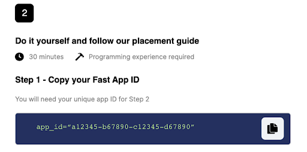

# Steps

## Part 1: Install Fast Plugin

1. Log into your WooCommerce store.
2. Click the Fast plugin button on the sidebar.

   > Note: When you went through the [Sign Up for Fast with WooCommerce process](/developer-portal/for-developers/woocommerce/pre-install/sign-up-as-a-seller/), this plugin was installed.

   

3. While keeping the WooCommerce page open, in a separate window, go to https://www.fast.co/business/dash/install and copy the app ID you see there.

   

4. Go back to the WooCommerce store window and paste the app ID into the textbox. Then click “Save Changes.”

   

## Part 2: Test Mode

1. Click the “Test Mode” tab.
   **By default, your store will be in test mode**. We recommend you keep the store in test mode by keeping the “Enable test mode” button checked. This way, only you and other store admins will see the Fast buttons.

   **Once you are ready to make the Fast buttons go live to the public, you can uncheck “Enable test mode” and the buttons will be visible to everyone on your site.**

| Option                             | Description                                                                                                                                                                                                                                                                                  |
| ---------------------------------- | -------------------------------------------------------------------------------------------------------------------------------------------------------------------------------------------------------------------------------------------------------------------------------------------- |
| **Test Mode**                      | If you want shoppers to see the changes you made to the online store’s styling, uncheck “Enable test mode” and then click “Save Changes.” Now, everyone can see the Fast buttons.                                                                                                            |
| **Debug Mode**                     | Enables you to log messages within the Fast plugin. If you are a developer looking to troubleshoot issues, you can check the debug mode checkbox to do that. If you check this, click “Save Changes” afterwards.                                                                             |
| **Disabled Multicurrency Support** | Can be used to disable multicurrency support. This is only necessary if you do not need to support multicurrency in the Fast checkout process and the store uses a third-party multicurrency plugin to handle multicurrency in WooCommerce. If you check this, click “Save Changes” afterwar |

## Part 3: Options

On the screen are several possible layouts for how the Fast button can look on the product page of your online store.

Here is what each option shows, as seen in the above image:

| Option                        | Description                                                                                                                                                                                                                 |
| ----------------------------- | --------------------------------------------------------------------------------------------------------------------------------------------------------------------------------------------------------------------------- |
| **Before Quantity Selection** | This option places the button just above the quantity selection field in the Add to Cart form.                                                                                                                              |
| **After Quantity Selection**  | This option places the button between the quantity selection field and the Add to Cart button.                                                                                                                              |
| **After Add to Cart Button**  | This option places the button just below the Add to Cart button.                                                                                                                                                            |
| **Other**                     | This fourth option is available for users with advanced understanding of WordPress hooks. If Other is selected, a valid WordPress action hook must be entered in the next field, “Enter Alternate Product Button Location.” |

Decide which layout you want for your store and click that layout. Then click “Save Changes.”

## Part 4: Verify Setup

### Product Page

1. In a new tab, go to the product page on your online store.

   > To go to a new tab, in the top left hand corner of the WooCommerce page, you will see your website name. Hover over that and command-click/right-click “Visit site” to open your online store in a new tab.

2. Go to a product page.

3. Make sure that the Fast button is located in a place on the page that looks good. If you want to change the location of the Fast button, repeat the previous step.

5. See if you like the way the Fast button looks or if you want to change something else about it like the width or the length. If you want to further adjust the styling, follow the steps in the section, [Styling the Buttons](/developer-portal/for-developers/woocommerce/custom-styling/custom-checkout-button-styling/).

6. Add the product to your cart.

### Cart

Go to the cart page of your online store and see how the Fast button looks. If you want to adjust the styling, follow the steps in the section, [Styling the Buttons](/developer-portal/for-developers/woocommerce/custom-styling/custom-checkout-button-styling/).

### Mini Cart

Go to the mini cart page of your online store and see how the Fast button looks. If you want to adjust the styling, follow the steps in the section, [Styling the Buttons](/developer-portal/for-developers/woocommerce/custom-styling/custom-checkout-button-styling/).

### Checkout Page

Go to the checkout page of your online store and see how the Fast button looks. If you want to adjust the styling, follow the steps in the section, [Styling the Buttons](/developer-portal/for-developers/woocommerce/custom-styling/custom-checkout-button-styling/).

### Login Page

Go to the login page of your online store and see how the Fast button looks. If you want to adjust the styling, follow the steps in the section, [Styling the Buttons](/developer-portal/for-developers/woocommerce/custom-styling/custom-checkout-button-styling/).

