# Pre Install Step 3: Onboard as a Seller with WooCommerce

## Prerequisites

Before you begin this process, you’ll need an online store hosted by WooCommerce.

**If you need help at any point, contact customer success at seller-support@fast.co.**

## Pin Validation

1. On [fast.co/business](https://www.fast.co/business), **enter the following information and click “Next”**:

   - **Your preferred email address** (You can add additional email addresses for access later.)
   - **Your first name and your last name** (If your business has multiple employees, you can add more people later and give those people various levels of access and permissions.)

     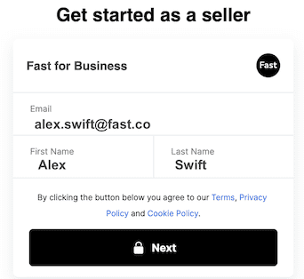

2. **Fast will now send a PIN number to your email inbox**. Open your email to find this PIN number and enter it here on Fast.
   **Note**: Fast doesn’t use passwords. We use PIN numbers instead.

   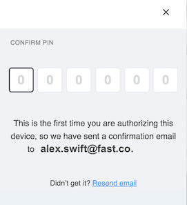

## Fill Out Your Profile

1. On the Org Details page, **enter the following information and then click “Next”**:

   - Your company name
   - Your company address
   - Your company phone number
   - Your referral number if you were referred to Fast through a partner (this is optional)

     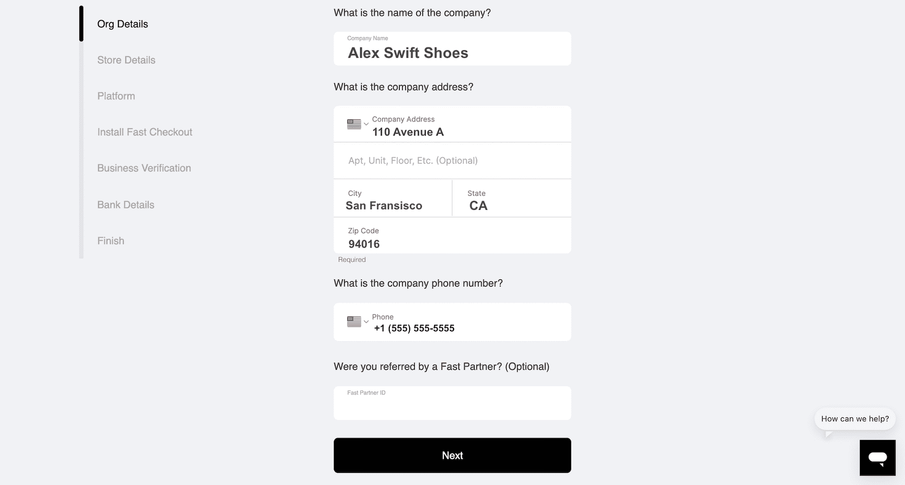

2. On the Store Details page, **enter the following information and then click “Next”**:

   - Your website domain
   - Your company name
   - The country where your business is registered

     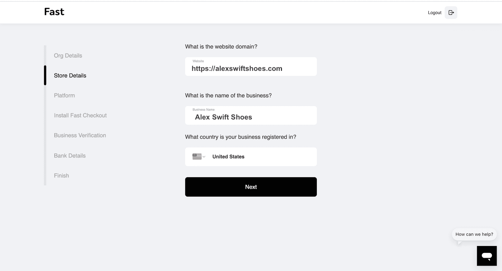

3. On the Platform Page, **click “WooCommerce.” Then click “Next”**.

   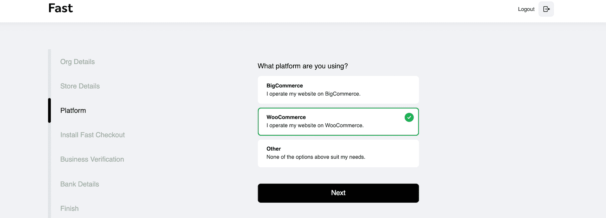

## Connect to WooCommerce

1. On the page that says “Connect to WooCommerce,” **click “Connect”**.

   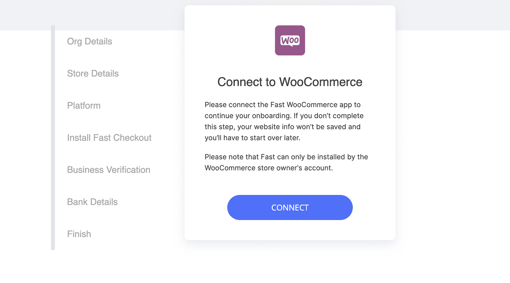

2. **Enter your username and password from your WooCommerce store account**.

   > **Note**: You need WooCommerce Store Admin access or higher to do this.

   > **Note**: When you reach this specific step, you’ll need to complete the step immediately without clicking the back button. Otherwise, you will have to restart this process from the beginning. This rule does not apply to other steps.

   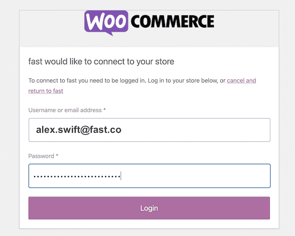

3. **Click “Approve”**.
   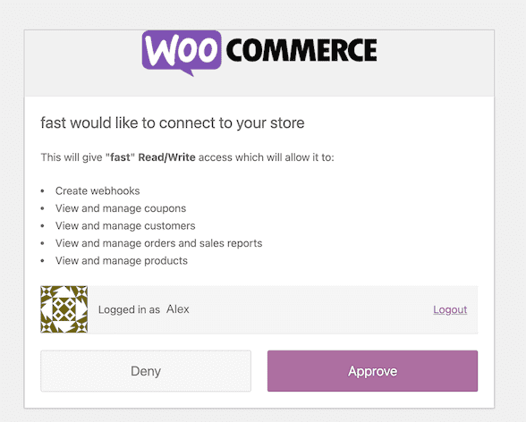

   > If you want to, you can click “Request professional installation.” **You don’t have to do this step**. If you do this step, then also click the X in the pop-up that appears and continue to the next step. If you choose not to do this step, simply go straight to the next step.

   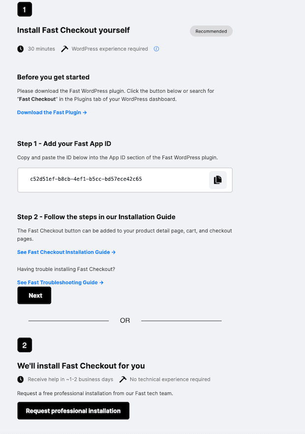

   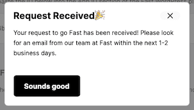

4. **Click “Next”**.
5. **Click “Continue account setup”**

   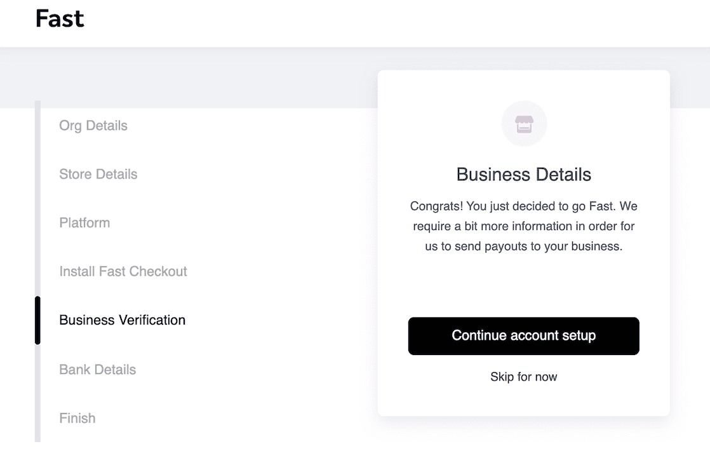

6. **Enter your tax ID**, such as your EIN or the equivalent depending on your region. Then **click “Continue”**

   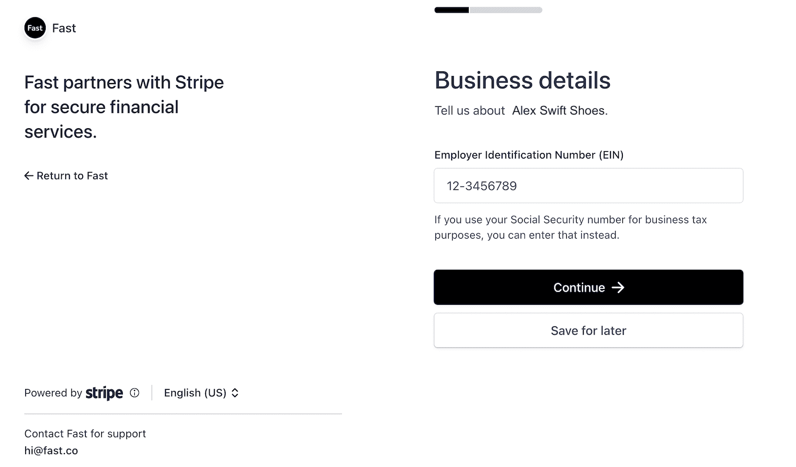

7. **Wait several seconds while Stripe verifies your business**. If this verification is unsuccessful, contact customer success at seller-support@fast.co. Otherwise, move onto step 14.
   **Note**: If you operate under a DBA, you will need to click the pencil icon in order to enter your legal name that correlates with your tax ID..

   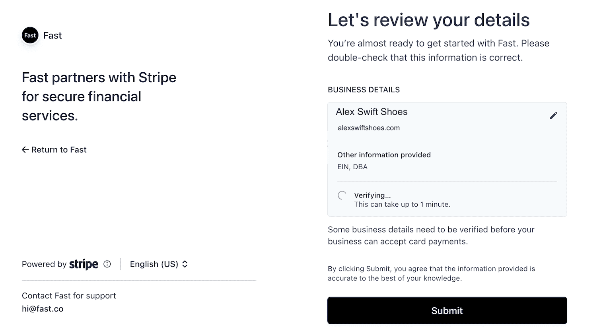

8. On the Bank Details page, **enter the following information and click “Finalize Application”**:

   - The legal entity the bank account was registered under
   - The currency you use, such as dollars or Euros
   - The country your bank account is in
   - The applicable bank account details depending on your region
     **Note**: Which settlement currency you can use depends on which country your business is registered in. And which bank account details you see depends on what settlement currency you use. See [this article](https://stripe.com/docs/connect/bank-debit-card-payouts#supported-settlement) for more information.

     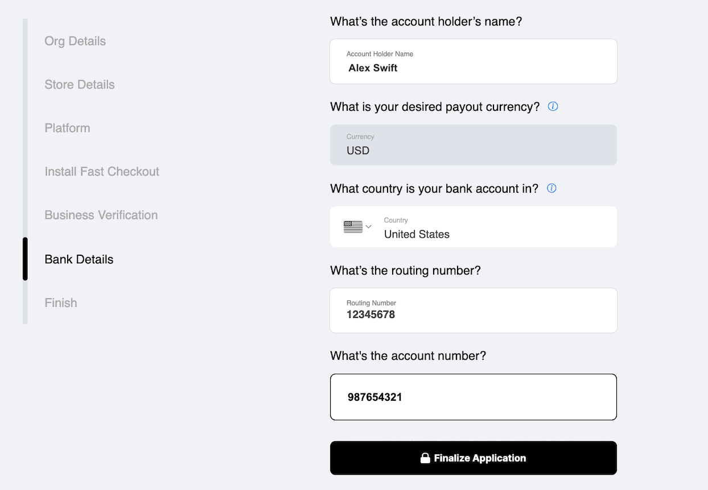

9. **Click “Continue to Dashboard”**.

   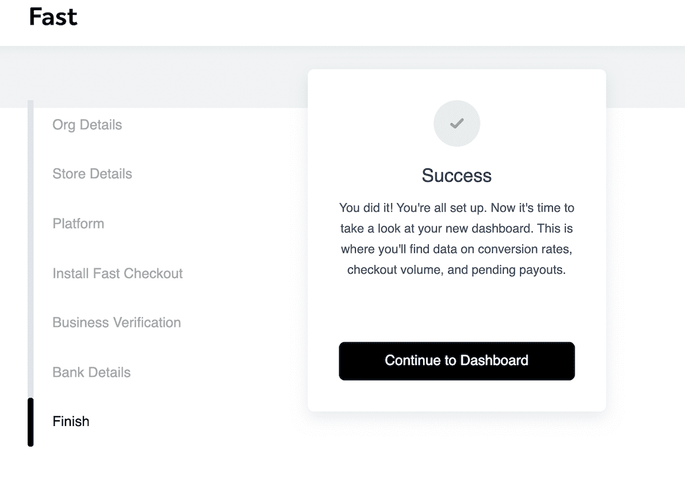
