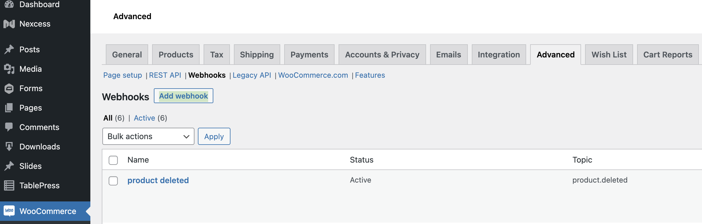

# Pre-Install Step 4: Verify API Key and Webhooks

## Introduction

During Fast Seller onboarding with WooCommerce, your WooCommerce store should be automatically provisioned with an API key and typically three order webhooks (for when an order is created, updated, or deleted). However three similar product webhooks are not typically automatically provided. Before proceeding with installation of the Fast Checkout for WooCommerce plugin, you should first verify the setup of both your API key and webhooks.

:::info adding missing webhooks
Webhooks that were not added to your profile automatically can be [manually added](#manually-add-missing-webhooks) at any time.
:::

## Verify API Key

:::attention WordPress Admin Access Required

You must have WordPress admin access to view and edit WooCommerce store settings.

Your WordPress store admin portal URL will normally look like this:
`https://yourwebsite.com/wp-admin`

:::

To confirm that the API key exists for your WooCommerce platform integration:

1. Go to **WooCommerce > Settings > Advanced > REST API**\
   There should be a Fast key with both **Read** and **Write** permissions.\
   [WooCommerce valid API key](images/woocommerce-valid-api-key.png)
   :::attention
   If the API key does not exist, contact [seller-support@fast.co](mailto:seller-support@fast.co) for help with troubleshooting your Seller onboarding issue.
   :::

## Verify Existing Webhooks

To view existing webhooks:

1. Go to **WooCommerce > Settings > Advanced > Webhooks**
   - You should see three **Order** and three **Product** webhooks listed.
   - If all of these webhooks are not present, you can [add the missing webhooks](#manually-add-missing-webhooks).
     \
      <embed src="/reusables/for-developers/_platform_woocommerce_settings_webhooks_plugin_status_tab.md" />

### Webhook Data Fields

<embed src="/reusables/for-developers/_platform_woocommerce_settings_webhook_data_table.md" />

<embed src="/reusables/for-developers/_fast_app_id.md" />

### Manually Add Missing Webhooks

1.  While logged in to your WooCommerce dashboard, go to **WooCommerce > Settings > Advanced > Webhooks**.
2.  Click the **Add webhook** button above the list of available webhooks.\
    
    - This will open the **Webhook data** screen where you can manually add a webhook.\
      
3.  Configure the webhook by providing the **Name**, **Topic**, and **Delivery URL** for each missing webhook as [described above](#webhook-data-fields):

    - Set the **Status** of the webhook to **Active**.
    - For **Secret**, copy and paste your existing Fast secret key from **WooCommerce > Settings > Advanced > REST API**.
    - For **API version**, leave as `WP REST API Integration v3`.
      <embed src="/reusables/for-developers/_fast_app_id.md" />

4.  Verify the details you just entered, then click **Save webhook**.
5.  Repeat these steps for each webhook that needs to be added.
6.  Verify the webhooks as [described above](#verify-existing-webhooks)
