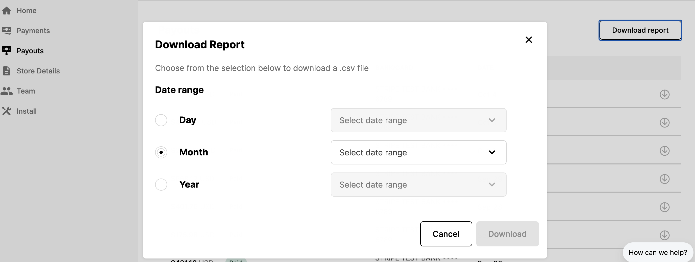

# Exporting Payment data overview

You can view your payout history and download a file for each payout containing a detailed transaction-level report on your Seller Dashboard!

## Steps

1. Log into you Seller Dashboard
2. Click the "Payouts" tab on the left side of the screen.
3. On the upper right hand corner, click "download report" to select the date range for the CSV file.
4. Select a report by day, month or year.
5. Once you export the document as a CSV, you can convert it to spreadsheet.

The file contains a column for the BigCommerce / WooCommerce order ID, which you can use to match with BigCommerce / WooCommerce orders.

