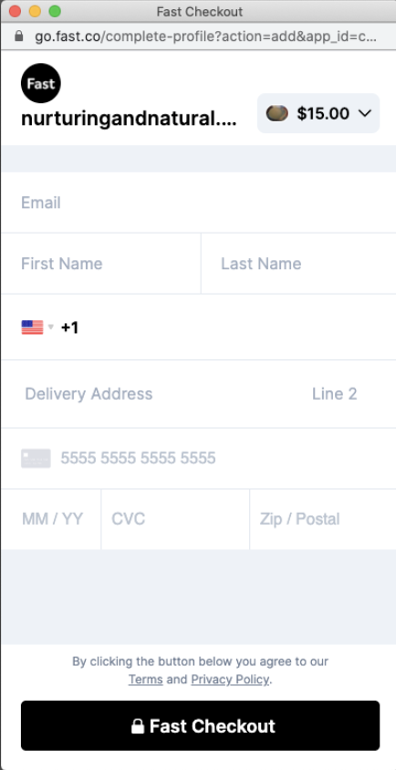
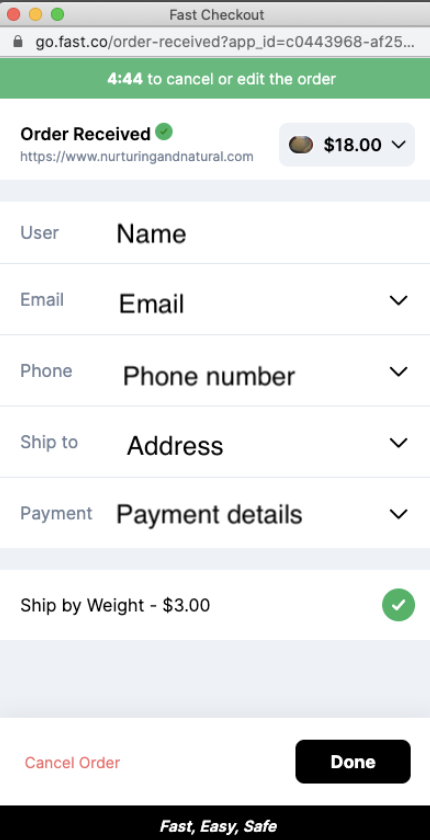

# What happens when a customer clicks Fast checkout

When a customer clicks Fast checkout a pop-up window will appear and a customer will either login to their Fast account or create a new account.

- **New Fast Account**: Asked to sign up with email, name, phone number, address, payment (image of form fields)
- **Existing Account**: sent to payment confirmation page (5-min window)

