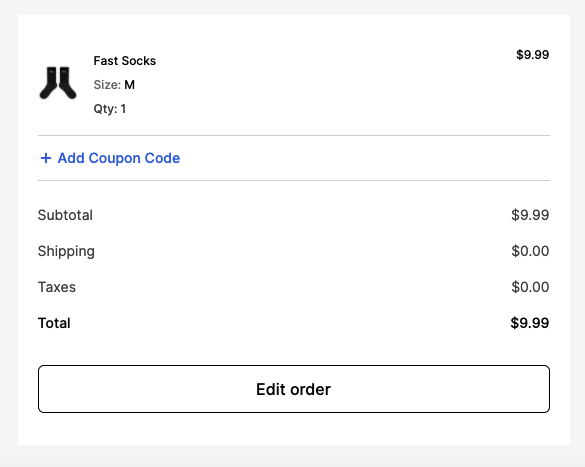
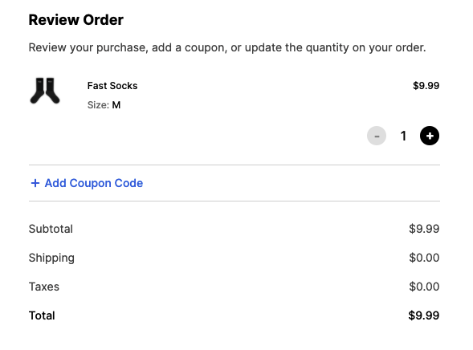
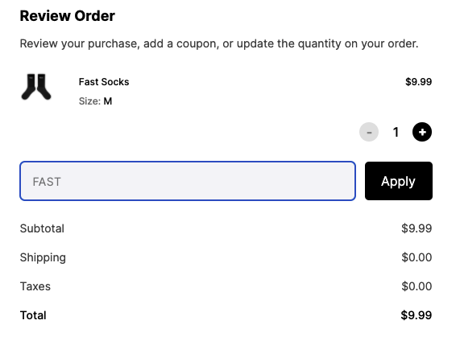

# Promo codes

## How can I apply a promo code to my purchase?

You can use promo codes in the *Order confirmation* popup page:

1. Click **Edit order**

   

2. Click **Add Coupon Code**

   

3. Enter the code into the field and click **Apply**.

   \
   The subtotal will automatically update to reflect the discounted price.

## Promo code confirmation

You will see a confirmation of the discounted price you paid in your second "Order Processing" email to accommodate any edits made during the 5-minute batching window.
