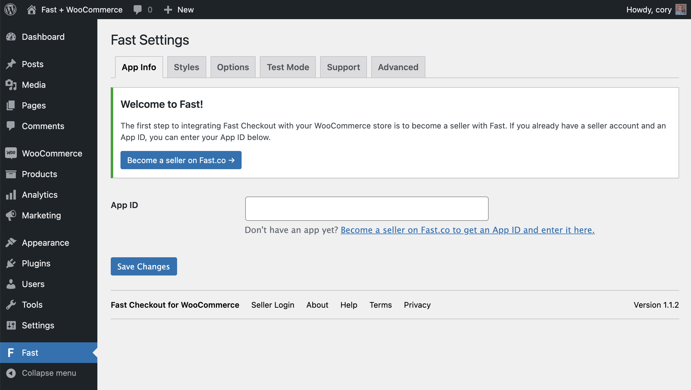
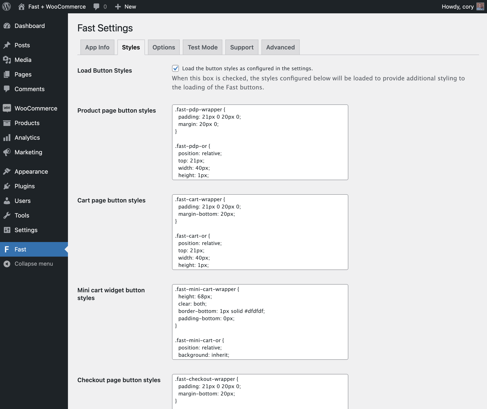
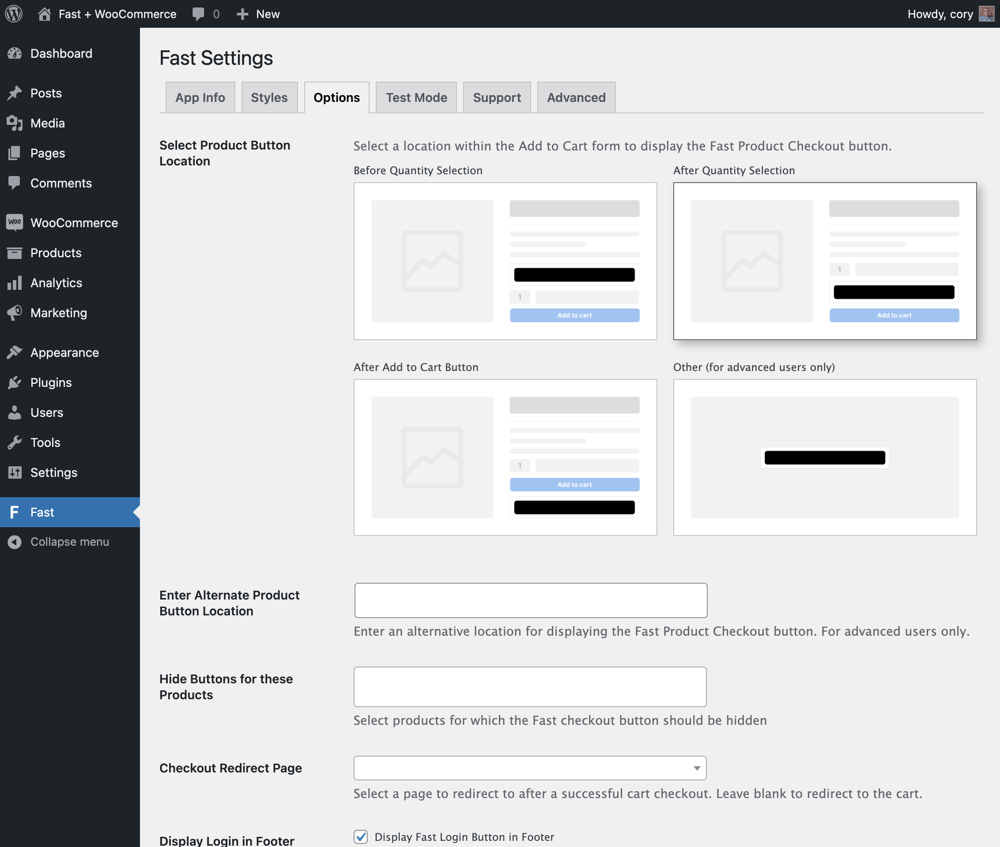
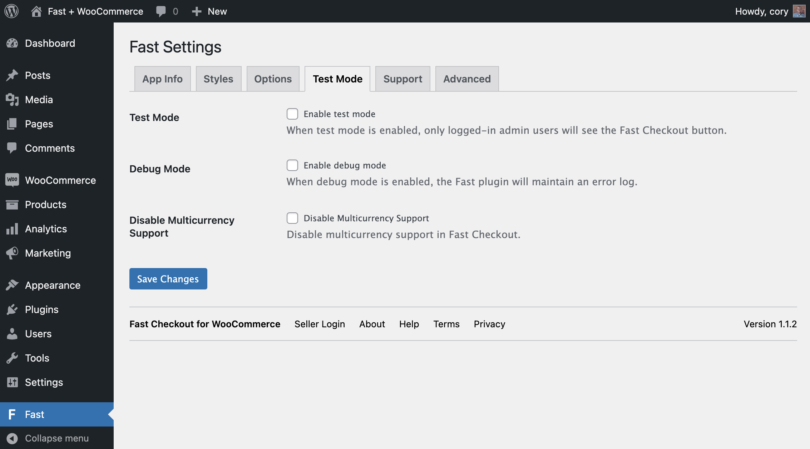

# Checkout for WooCommerce Settings

The Fast Checkout for WooCommerce plugin has several settings to configure your Fast Checkout installation. The Fast Settings page in your WordPress admin is divided into five tabs. The first four tabs contain settings, and the fifth tab is a Support tab with basic documentation and a link to get help from Fast. The first four tabs are [App Info](#app-info-tab), [Styles](#styles-tab), [Options](#options-tab), and [Test Mode](#test-mode-tab).

## App Info Tab

## Styles Tab

## Options Tab

## Test Mode Tab

