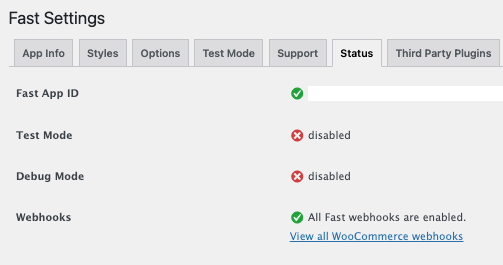

:::info CURRENT FAST CHECKOUT FOR WOOCOMMERCE PLUGIN USERS: CHECK WEBHOOK STATUS FROM PLUGIN SETTINGS
Once you have completed [all of the Fast Checkout for WooCommerce plugin installation steps](/developer-portal/for-developers/woocommerce/install/install-plugin/), you can also check the status of your existing webhooks from the ["Status" tab within the settings of the Fast Checkout for WooCommerce plugin](/developer-portal/for-developers/woocommerce/customization/custom-settings#status-tab).

The URL where you can view the status of WooCommerce webhooks should look something like:
`https://yourwebsite.com/wp-admin/admin.php?page=fast&tab=fast_status`
:::
